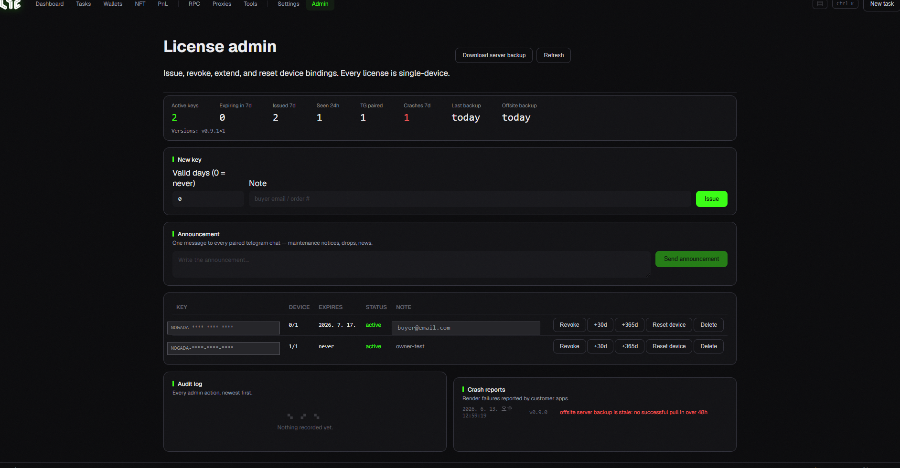

# Admin (operators only)

This screen appears in the menu **only when logged in with an operator (admin) license.** Regular users never see it. It handles license issuing/management and operational status.

> 🙋 **If you're a regular user, you can skip this page.**

## Fleet stats tiles

Operational metrics at a glance:

* **Active keys / Expiring in 7d / Issued in 7d**
* **Seen in 24h / Telegram paired**
* **Crashes 7d** (errors reported by customer apps)
* **Last backup / Offsite backup** · **Version distribution**

## Key management

* **Issue new key** — enter valid days (0 = never) + note (buyer email/order #) and issue.
* **Key list** — per key:
  * **Revoke** / Unrevoke — block/restore access
  * **+30d / +365d** — extend expiry
  * **Reset device** — release the device binding so the user can re-activate on a new PC
  * **Delete** — permanently delete (user loses access)

## Ops tools

* **Broadcast** — send one message to all paired Telegram chats (maintenance, drops, news).
* **Audit log** — every admin action, newest first.
* **Crash reports** — render errors reported by customer apps.
* **Download server backup** — pull the latest license DB to the operator's PC (offsite backup).

> 💡 You can issue/revoke keys here, or via the server CLI. On a Whop purchase, keys are issued **automatically**, so manual issuing here is rarely needed.
