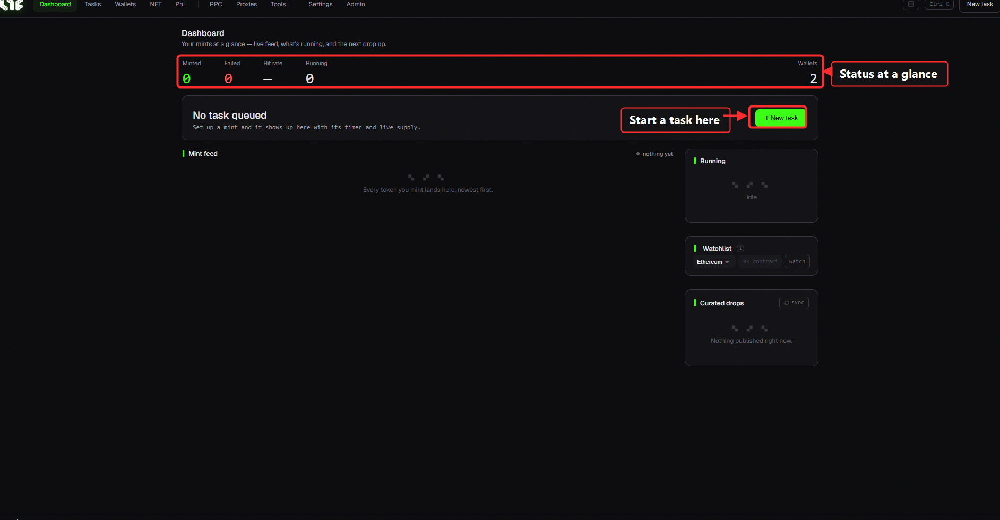

# Dashboard

The first screen you see when you open the app. It shows your minting status **at a glance**.

## Common — elements on every screen

* **Top menu (left)**: Dashboard · Tasks · Wallets · NFT · PnL · RPC · Proxies · Tools · Settings. Click to switch screens.
* **Top-right buttons**
  * **⌘K (Ctrl + K)** — opens the **command palette** anywhere; jump to any screen or run a command just by searching.
  * **New task** — quickly create a new minting task.
  * **Row spacing toggle** — switch lists between compact/comfortable.
* **Bottom status bar**: `Ready` · `Gas` (live gas price) · `rpc` (connected RPC count) · `Sync` (server time offset) · `Authenticated ●` (green when license is OK) · `version`.

> 💡 The **gas number** at the bottom is live. Use it to quickly check gas isn't spiking right before you mint.

## Dashboard sections

* **Stat tiles** — Mints succeeded / failed / success rate / running / wallet count
* **Pending tasks** — tasks you've created appear here. Create one with `+ New task`.
* **Mint feed** — successfully minted tokens stack up here, newest first.
* **Running** — status of currently running tasks.
* **Watchlist** — add a collection's contract address and click **Watch**; you'll be alerted when supply moves. (Link Telegram and you'll get alerts even with the app closed.)
* **Featured drops** — shows posted recommended drops, if any.

> 💡 **Watchlist + Telegram**: drops you add to the watchlist are monitored 24/7 by the Telegram bot. Even with the app closed, you get an alert when a drop goes live. → [Telegram Bot](../telegram/telegram-bot.md)
