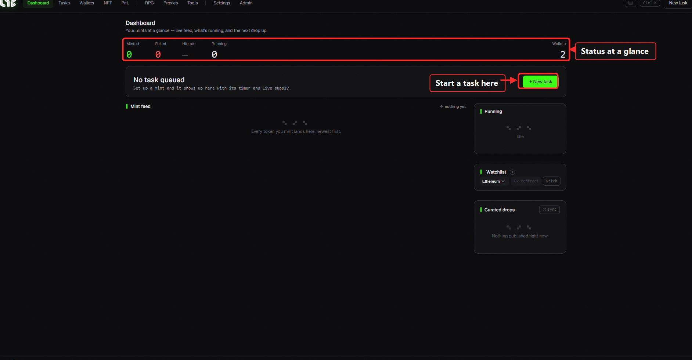

# Dashboard

The first screen you see when you open the app. It shows your minting status **at a glance**.

## Common: elements on every screen

* **Top menu (left)**: Dashboard · Tasks · Wallets · NFT · PnL · RPC · Proxies · Tools · Settings. Click to switch screens.
* **Top-right buttons**
  * **⌘K (Ctrl + K)**: opens the **command palette** anywhere — type to jump to any screen or run a command.
  * **New task**: quickly create a new minting task.
  * **Row spacing toggle**: switch lists between compact/comfortable.
* **Bottom status bar**: `Ready` · `Gas` (live gas price) · `rpc` (connected RPC count) · `Sync` (server time offset) · `Authenticated ●` (green when license is OK) · `version`.

> 💡 The **gas number** at the bottom is live. Use it to quickly check gas isn't spiking right before you mint.

## Dashboard sections

* **Stat tiles**: Mints succeeded / failed / success rate / running / wallet count
* **Pending tasks**: tasks you've created appear here. Create one with `+ New task`.
* **Mint feed**: successfully minted tokens stack up here, newest first.
* **Running**: status of currently running tasks.
* **Watchlist**: add a collection contract and click **Watch** to see supply changes while the app is running. A supply change is not proof that minting opened.
* **Featured drops**: shows posted recommended drops, if any.

> 💡 The app Watchlist and Telegram Drop Watch are separate. Add a drop independently in the bot for 24/7 monitoring; the app list never synchronizes to the bot. → [Telegram Bot](../telegram/telegram-bot.md)
