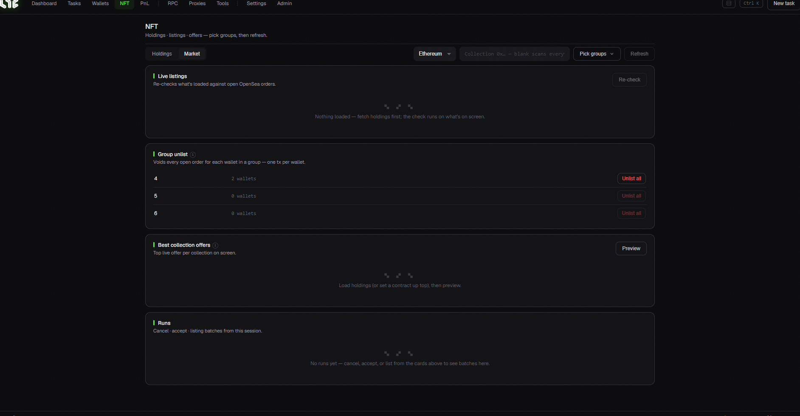

# NFT (Holdings · Market)

View NFTs you've minted, and buy/sell on OpenSea. There are two tabs at the top: **Holdings / Market**.

## Common

* **Chain selector / Group selector / Refresh** — choose which chain & wallet group to view, and refresh.

## 📦 Holdings tab

Shows the NFTs your wallets hold.

> ⚙️ To load holdings you need an **Alchemy URL**. Add one per chain in [Settings → Setup](../app-guide/settings.md). (Without it you'll see "Alchemy URL not configured".)

## 🏷️ Market tab

For OpenSea listings & offers. (Most actions need an **OpenSea API key**. → [Settings](../app-guide/settings.md))

* **Live listings** — matches your loaded NFTs against OpenSea's open orders. "Re-check" to refresh.
* **Cancel All (per group)** — cancel all open listings of every wallet in a group at once (one transaction per wallet). Each group shows its wallet count.
* **Collection best offer** — preview the current best offer per collection.
* (Create listing / accept offer are also here.)

> 💡 **If you only mint, you can ignore this screen.** It's an advanced screen for selling or managing minted NFTs on OpenSea.
