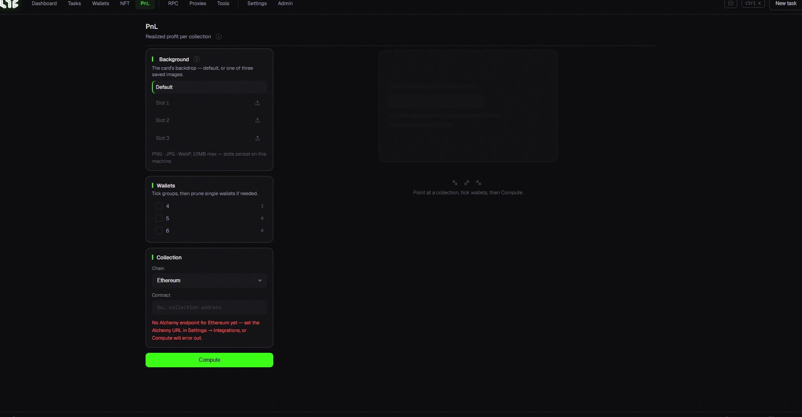

# PnL (Profit & Loss)

Calculates your minting cost and profit, and turns it into a **shareable card image**.

## How to use

1. **Collection**: enter the chain + contract address to calculate PnL for.
2. **Wallets**: check the wallets (group) to include.
3. **(Optional) Card background**: use the default, or upload your own background to one of the 3 image slots (PNG/JPG/WebP, up to 10MB). Slots are stored on this PC only.
4. **Calculate**: the result is rendered as a **PnL card** (realized P&L / ROI / gas / total spent / proceeds).

> ⚙️ PnL calculation also needs an **Alchemy URL**. Add one per chain in [Settings → Setup](../app-guide/settings.md).

> 💡 Green = profit, red = loss. Just screenshot the card to share it.
