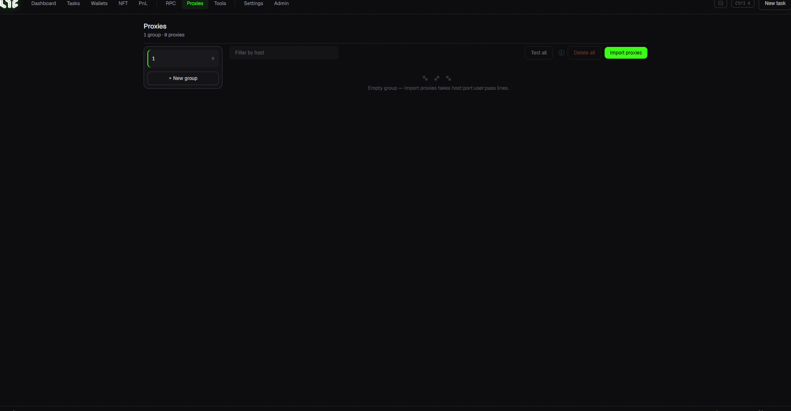

# Proxies

Proxies hide your real IP so requests don't all come from the same place. **Most regular mints don't need them**, but they help when you have many wallets or do website-based tasks.



## When do you need them?

* When using dozens/hundreds of wallets or accounts for **website tasks (WL sites, Twitter, Discord)**: coming from one IP can trigger bot detection, bans, or suspensions, so proxies distribute them across different IPs.
* If you just mint to a contract, you usually **don't need them.**

## Format

Proxies are usually in this format:

```
host:port:username:password
```

You can paste many, one per line.

## Layout / buttons

* **Group rail (left)**: manage proxy groups. `+ New group`.
* **Import proxies**: paste in the format above.
* **Test all**: check whether they work and how fast they respond.
* **Delete all**: empty the group.
* **Filter by host**: search when you have many.

## Proxy types (briefly)

* **Residential**: real home IPs. Billed per GB, usable while data remains. Slower. Beginner-friendly.
* **ISP**: faster and more stable, usually billed per IP per month.

Recommended providers & how to buy → [Proxy links](../resources/proxies.md)
