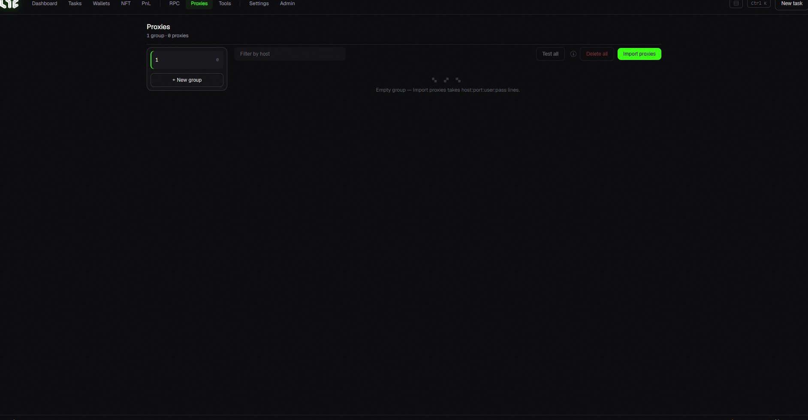

# Proxies

Proxies route mint lookup, voucher requests, and transaction propagation through a user-selected network path. **Most direct contract mints do not need one.**



## When do you need them?

* Use them when many wallets request signed/voucher data at the same time and the API route needs distribution.
* Selecting a proxy group pins that task to its route. If the selected proxy fails, Nogada reports the failure instead of silently switching to a direct connection.
* A direct contract mint often has a shorter path without a proxy.

## Format

Proxies are usually in this format:

```
host:port:username:password
```

You can paste many, one per line.

## Layout / buttons

* **Group rail (left)**: manage proxy groups. `+ New group`.
* **Import proxies**: paste in the format above.
* **Test all**: check whether they work and how fast they respond.
* **Delete all**: empty the group.
* **Filter by host**: search when you have many.

## Proxy types (briefly)

* **Residential**: useful when varied IPs are needed, but latency may be higher.
* **ISP**: often has steadier latency and connections, with large provider-to-provider differences.

Recommended providers & how to buy → [Proxy links](../resources/proxies.md)
