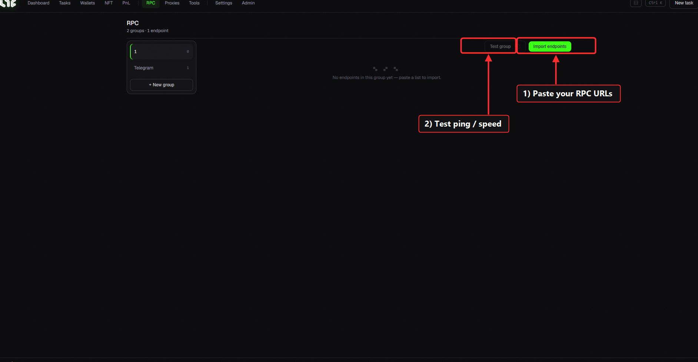
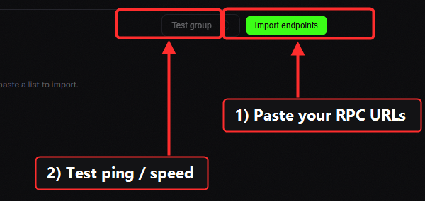
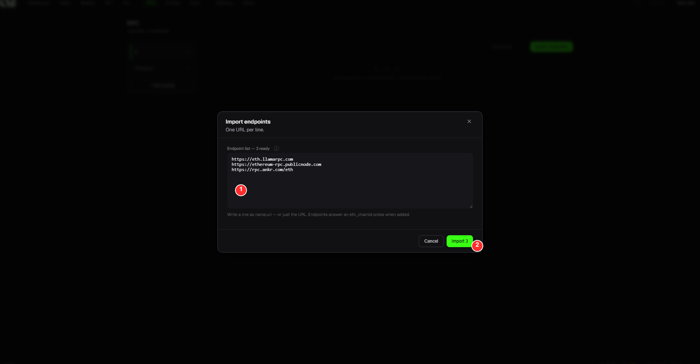

# RPC

An **RPC** is the pipe the app uses to talk to the blockchain. It's one of the most important settings: it directly affects minting **speed and success rate**.

> 🔍 *Close-up: 1) **Import endpoints** (paste URLs) → 2) **Test group** (check speed).*

## Layout

* **Group rail (left)**: organize RPCs into groups. `+ New group`.
* **Import endpoints**: paste RPC addresses to add (multiple lines = multiple).
* **Test group**: measure response speed (ping) of your RPCs.

## Adding RPCs for free (Chainlist)

1. Go to [chainlist.org](https://chainlist.org) and search your chain.
2. Copy a few **HTTPS RPC addresses** from the top.
3. Paste them into **Import endpoints** on the Nogada **RPC** screen.
4. Run **Test group** and keep only the fast (low-ping) ones.

### 🎯 Worked example: import 3 RPCs

Click **Import endpoints**, then:

| # | Step |
|---|---|
| ① | **Paste the URLs**: one per line (here: 3 free public Ethereum RPCs) |
| ② | Click **Import**: they're added to the group. Then hit **Test group** and keep the fastest (low-ping) ones. |

> 💡 The example URLs above are free public RPCs (fine to start with). For competitive mints, also add a **paid / dedicated** RPC → [RPC / Node links](../resources/nodes.md)

## Paid RPC (strongly recommended for competitive mints)

Low-supply FCFS (first-come-first-served) mints sell out in 1–2 blocks. Public RPCs often **rate-limit** you here, so a paid dedicated RPC has the edge.

* Recommended providers & how to buy → [RPC / Node links](../resources/nodes.md)

> 💡 **Different providers work better on different chains.** Keep 1–3 ready, test them, and use the fastest. There's no single right answer for RPC selection.

## Multi-RPC broadcast

In [Settings → Setup](../app-guide/settings.md), enabling **Multi-RPC broadcast** sends your transaction to **several RPCs at once**, raising the odds of landing in a block faster.

> 💡 **RPCs are used automatically once you add them.** If a task has **no RPC checked**, it uses **all your registered RPCs + the public node pool** together (the widest spread). Only **check** specific RPCs when you want to use those alone (checking them excludes the public pool).
