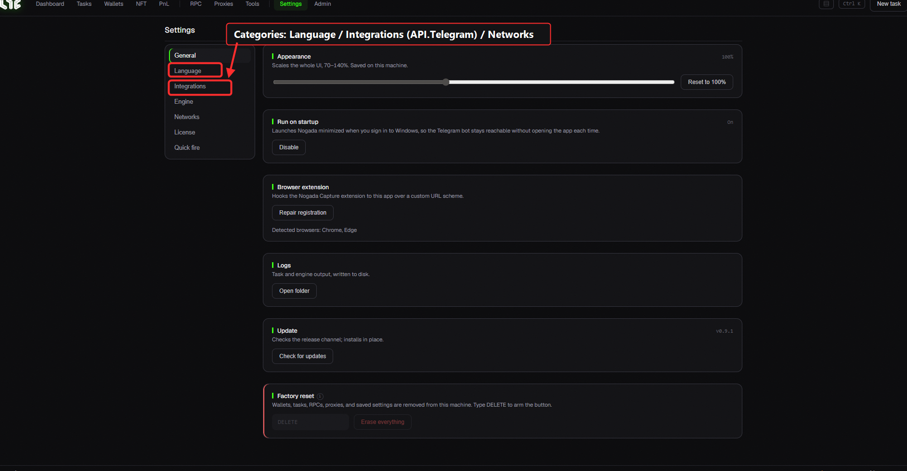
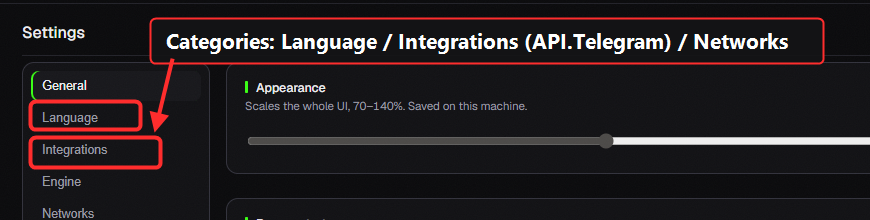

# Settings

Configure app behavior and API keys. There are **7 tabs** on the left.

> 🔍 *Close-up: the left rail switches between categories — **Language**, **Integrations** (API/Telegram), Networks, etc.*

## General

* **UI scale**: zoom the whole UI 70–140% (saved on this PC).
* **Run on startup**: auto-launch Nogada minimized at Windows login (so the bot/alerts run in the background).
* **Browser extension**: connect the Nogada Capture extension (detected: Chrome/Edge).
* **Logs**: open the folder where task/engine output is recorded (for troubleshooting).
* **Check/Apply update** · **Factory reset**: use carefully.

## Language

* Switch **한국어 / English**. The whole app changes instantly.

## Integrations: API keys

> These are **optional**. **Minting works without keys.** Each key enables an extra feature.

| Key | Used for | Get it at |
|---|---|---|
| **OpenSea API key** (≤5) | listing status · best offers · listing/accept | docs.opensea.io |
| **Alchemy URL** (per chain) | NFT holdings · PnL | [alchemy.com](https://www.alchemy.com) |
| **Etherscan key** | Fetch ABI · explorer lookups | [etherscan.io](https://etherscan.io) |
| **Captcha keys** (CapMonster/CapSolver/2captcha) | auto-solve captcha (only some mints) | each provider |
| **Discord webhook** | mint success/fail alerts to Discord | Discord channel settings |

More links → [Resources](../resources/nodes.md)

## Engine: minting behavior

* **Gas**: auto tip multiplier (×), minimum priority (gwei floor).
* **Flashbots**: bundle on/off, window/priority/max, reputation key (copy/reset).
* **Spam guardrail (sec)**: safety window for spam minting (blank = off).
* **Multi-RPC broadcast**: send transactions to several RPCs at once (faster).

## Network

* **Per-chain public RPC override**: replace the default public RPC.
* **Show/hide chains**: hide chains you don't use.

## License

* **Activate / Deactivate (release device)**: release here when switching PCs, then activate on the new one.
* **HWID**: this machine's identifier (copyable).

## Quick Fire

* **Quick task wallets / RPCs**: set the default wallets/RPCs for fast minting (live mints, etc.).
