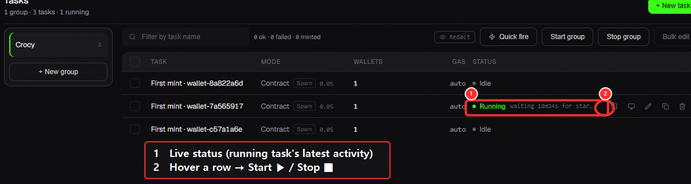
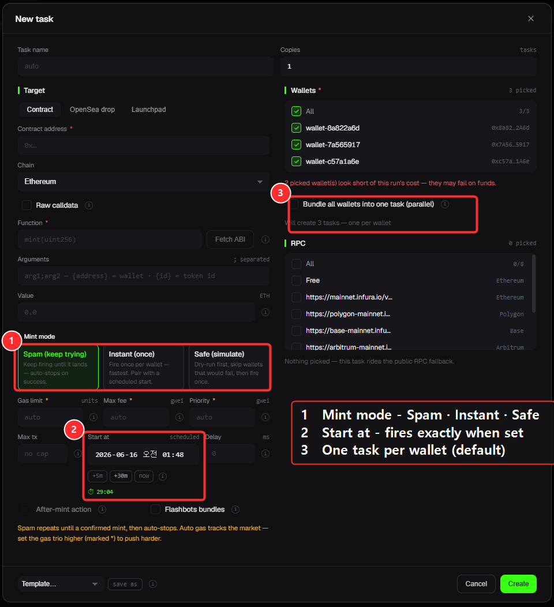
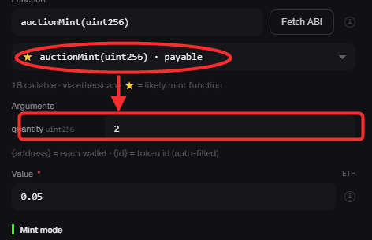
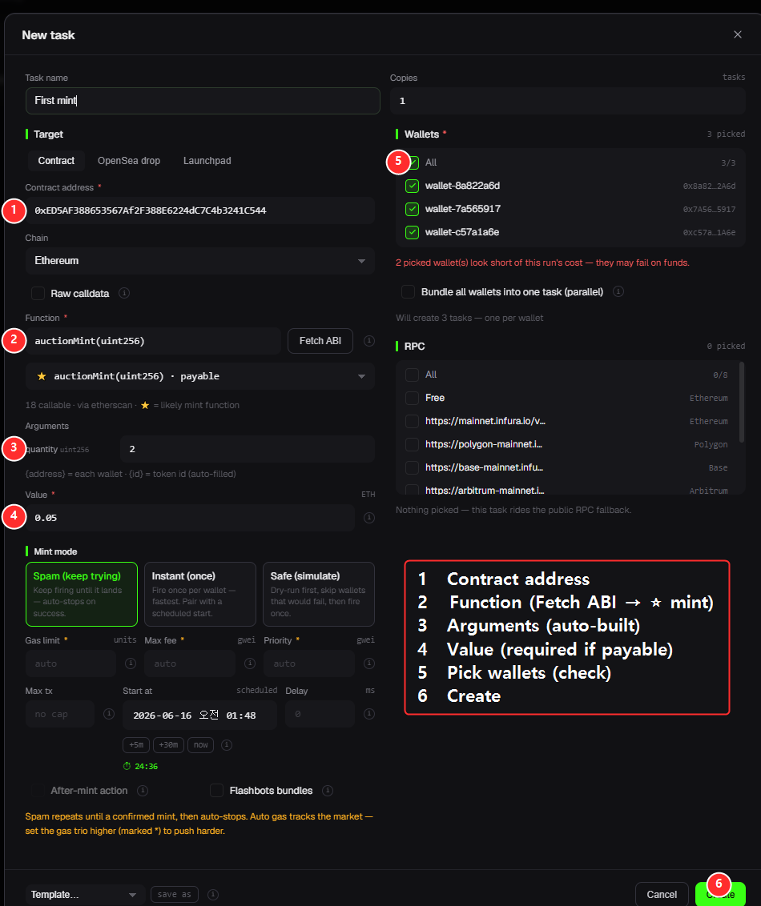

# Tasks — the heart of minting

A **task** is one minting setup that holds "which contract, with which wallets, and how to mint." Create a task and **Run** it to start minting.

> ⭐ **Confused by mint modes (Instant·Safe·Spam), delay, guardrail, scheduled start, or many wallets (parallel)? Read → [Mint Modes explained](../minting/modes.md)** first. This page is about *where things are*; that page is about *when to use what*.

## Layout

* **Group rail (left)** — organize tasks into groups. Create one with `+ New group`. (e.g. "WL mints", "Public")
* **Toolbar (top-right)**
  * **+ New task** — opens the task editor (detailed below).
  * **Quick Fire** — fire selected tasks fast.
  * **Start group / Stop group** — run/stop all tasks in a group at once.
  * **Bulk edit** — edit settings of multiple tasks together.

> ⚠️ Tasks go **inside a group**. If you have no group yet, create one with `+ New group` first.

---

## ⭐ Creating a task (full editor walkthrough)

Click `+ New task` to open the editor. Let's go field by field.

> 🔍 *Close-up: type the contract address, then click **Fetch ABI** to auto-fill the function.*

### 🎯 Worked example — your first mint

**Goal:** mint **1 NFT at 0.05 ETH** using **2 wallets**. Just fill the editor by the numbers:

| # | Field | What to do (with example values) |
|---|---|---|
| ① | **Contract address** | Paste the NFT's contract address — e.g. `0x4E1f…480e56` |
| ② | **Fetch ABI → Function** | Click **Fetch ABI**; the app reads the contract and lists its functions. Pick **`mint(uint256)`** and the Function field fills in. |
| ③ | **Arguments** | Pick a function and its **argument fields appear automatically** (name + type). For `mint(uint256)` that's just the **quantity field → `1`** |
| ④ | **Value (ETH)** | The mint **price per item → `0.05`** (put `0` for a free mint) |
| ⑤ | **Wallets + RPC** | Tick the wallets to mint with (**All** = both here), and tick at least one **RPC** |
| ⑥ | **Create** | Done — the task drops into your list, ready to **Run** |

> 💡 The red *"wallets look short on funds"* note just means those wallets don't hold 0.05 ETH yet. Top them up first → [Manage Funds](../app-guide/wallets.md).

> 🧩 **Don't know the function or arguments?** That's exactly what **② Fetch ABI** is for — it shows you the contract's real functions so you don't have to guess. For most public mints it's `mint(uint256)` with the quantity as the argument.

---

### Left — "what to mint"

| Field | What to enter |
|---|---|
| **Task name** | Leave blank to auto-name. Type your own to tell tasks apart. |
| **Target (tabs)** | **Contract** / **OpenSea Drop** / **Launchpad** (see below) |
| **Contract address** | The NFT contract to mint (`0x...`) |
| **Chain** | The chain to mint on (Ethereum, Base, etc.) |
| **Raw calldata** | Check to enter **raw hex data** instead of a function (advanced) |
| **Function** | The mint function (e.g. `mint(uint256)`). Use **Fetch ABI** to auto-fill |
| **Arguments** | **Pick a function from the ABI and one field per argument is built for you** (name + type) — no guessing the order. `{address}` = each wallet, `{id}` = token id (auto-replaced). If the function is **payable, Value is required** (red asterisk). _(Without an ABI, type them separated by `;`)_ |
| **Amount (ETH)** | Mint price (per item). `0` if free |

#### 🔧 "Fetch ABI" — no need to type the function by hand

Enter the contract address and click **Fetch ABI** to **auto-load the contract's function list** as a dropdown. Pick the mint function (`mint`, `publicMint`, etc.) and the field fills in. (Add an Etherscan API key in [Settings](../app-guide/settings.md) for best results; it falls back to Sourcify without one.)

> 💡 **Target tab differences**
> * **Contract** — mint directly with a contract address + function (most common)
> * **OpenSea Drop / Launchpad** — just paste the mint link and it **auto-detects the phase**. Pick the phase, fill the rest, done. (Supported: OpenSea, Transient)

### Right — "how to mint"

| Field | What to enter |
|---|---|
| **Copies** | How many times to repeat the task |
| **Wallets** | Check the wallets to mint with. Check **All** to select everything |
| **RPC** | Check the RPC endpoints to use (none = runs on public RPC) |

### Execution settings (scroll down)

The editor also has gas and timing settings: **Gas Limit / Max fee (gwei) / Priority (gwei) / nonce / start time / delay / Simulation / Spam mode / Flashbots bundle**. Leave **Gas Limit blank** so the app estimates it safely. Full guide → [Gas Settings Explained](../minting/gas.md)

### Bottom — save

* **Templates** — save/load frequently used settings.
* **Cancel / Create** — **Create** makes the task.

---

## 📋 New-task window — every field explained

> Every field in the new-task popup, in one place. For *when to use what*, see → [Mint Modes explained](../minting/modes.md).

### 🎯 Target — "what to mint"
| Field | What it is |
|---|---|
| **Target tab** | **Contract** (by address) / **OpenSea drop** (link) / **Launchpad** |
| **Contract address / mint link** | The NFT's `0x…` address, or an OpenSea/launchpad **link** |
| **Chain** | The blockchain to mint on (Ethereum, Base, …) |
| **Raw calldata** _(advanced)_ | Paste **hex calldata** instead of a function. Rarely needed |
| **Function** | The mint function (e.g. `mint`). Auto-filled by **Fetch ABI** |
| **Arguments** | The values the function needs. **Pick a function and fields appear** per argument (name + type). `{address}`/`{id}` auto-fill |
| **Value (ETH)** | Price per item. `0` if free. **Required if the function is payable** (red asterisk) |

### 🔥 Mint mode (3 choices)
| Mode | What it does |
|---|---|
| **Instant (once)** | One shot per wallet — fastest (pair with a schedule) |
| **Safe (simulate)** | Dry-run first, skip would-fail wallets, then fire once |
| **Spam** | Repeat until it lands → **auto-stops on success** |

### ⛽ Gas (fees)
| Field | What it is |
|---|---|
| **Gas limit** | Max gas the tx may use. Usually auto (blank) |
| **Max fee** | Highest gas price per unit you'll pay (gwei). Auto = tracks the market |
| **Priority** | Miner tip (gwei). Higher = mined sooner — the edge in a race |

### ⏱️ Timing & repeat
| Field | What it is |
|---|---|
| **Start at** | Scheduled fire time (calendar+clock, your local time). Blank = now |
| **Delay** _(spam)_ | Gap between retries. `100` = every 0.1s, `0` = max speed |
| **Max tx** _(spam)_ | Cap on sends. Blank = unlimited (until success / manual stop) |
| **nonce** _(non-spam)_ | The tx sequence number. Usually auto |

### 👛 Wallets & RPC
| Field | What it is |
|---|---|
| **Wallets** | Wallets to mint with (pick many). **Default: one task per wallet** (parallel). Or "bundle into one task" |
| **RPC** | Nodes to use. None = public RPC |

### ⚙️ Options
| Field | What it is |
|---|---|
| **After-mint action** | On a mint, auto **transfer / list on OpenSea / accept an offer** |
| **Flashbots bundles** | Submit via the **private mempool** (Ethereum only) — no public-mempool exposure; dodges sandwich/front-run |
| **Copies** | Make N identical tasks |
| **Template** | Save/load a reusable run setup |

---

## ▶ Firing it: Run · Quick Fire · Stop · Boost

Once the task is created, here's how you actually send it:

* **Run** — fires **this one task**. Transactions go out at the task's start time (or immediately if start = `now`).
  *Example: you set up a WL mint with start time = the phase open, hit **Run**, and it auto-sends the moment the window opens.*
* **⚡ Quick Fire** — the fastest path. **Tick** one or more tasks, hit **Quick Fire**, and they all fire **at once, right now** — no editor, no waiting.
  *Example: a surprise stealth mint drops. You already have the task saved → tick it → **Quick Fire** → it sends instantly.*
* **Stop** — stops a running task.
* **🚀 Boost** — transaction stuck pending (gas too low)? Boost **re-sends it at higher gas** so it lands. → [Transaction Boost](../minting/boost.md)
* **Start group / Stop group** — Run or Stop **every task in a group** together (great for firing many wallets/contracts at once).

> 💡 **Best practice**: 3–5 minutes before mint time, **Stop and Run again** — this reloads the latest on-chain data (projects sometimes change settings at the last minute).
