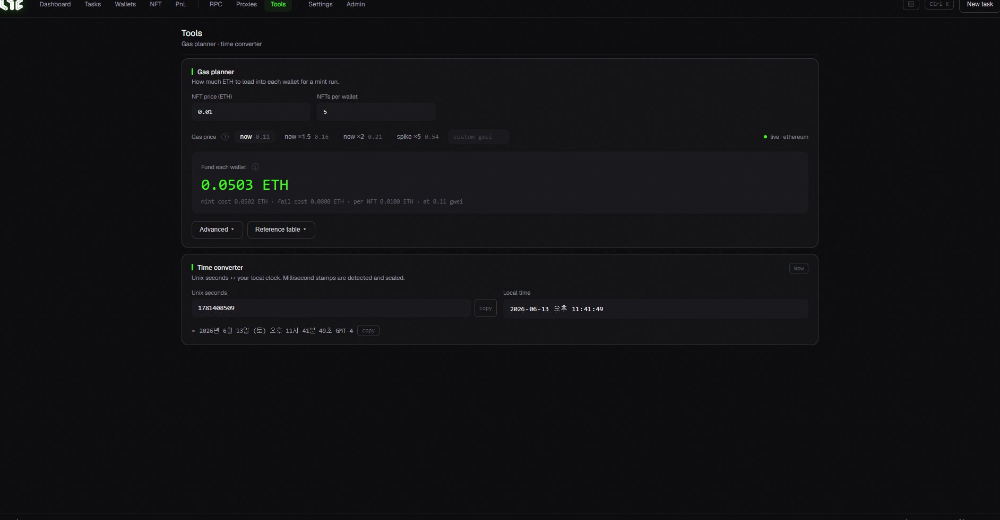

# Tools (Gas Calculator · Time Converter)

Helper tools to **estimate cost and time before minting.**

## ⛽ Gas Planner

Estimates how much ETH per wallet a mint will cost.

1. **NFT price (ETH)**: price per mint (0 if free).
2. **Quantity per wallet**: how many each wallet mints.
3. **Gas price**: pick a button or type your own:
   * **Current**: current price as-is
   * **Current ×1.5 / ×2**: a bit / a lot higher (competitive)
   * **Spike ×5**: for gas wars
   * **Custom (gwei)**: your own value
4. **Total per wallet**: computed **live** from the above (mint cost + gas).

> 💡 Keep **20–50% more ETH than this number** in each wallet to be safe; complex contracts can use more gas.

* **Advanced / Reference table**: expand a per-gas-price cost table.

## 🕐 Time Converter

Converts **Unix timestamp ↔ your local time** both ways. Useful when a project announces "mint starts at Unix 169…s" and you want it in your exact local time.

* Enter Unix seconds → your local time
* (and vice versa) · **Copy** button to copy the result

> 💡 Knowing the drop time to the second makes a real difference in FCFS mints.
