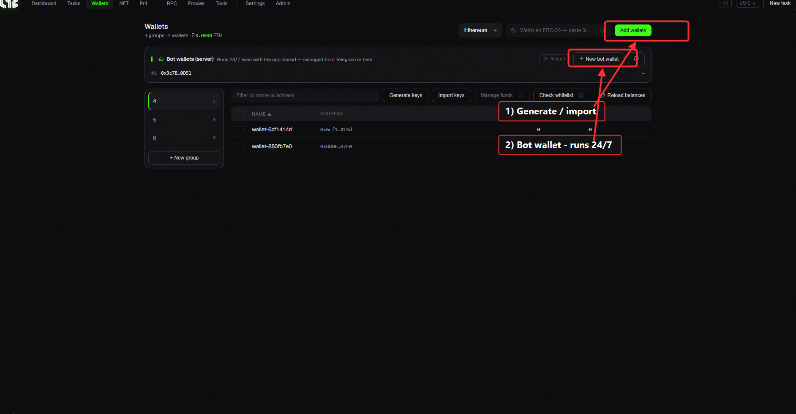
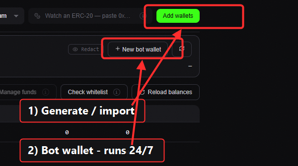
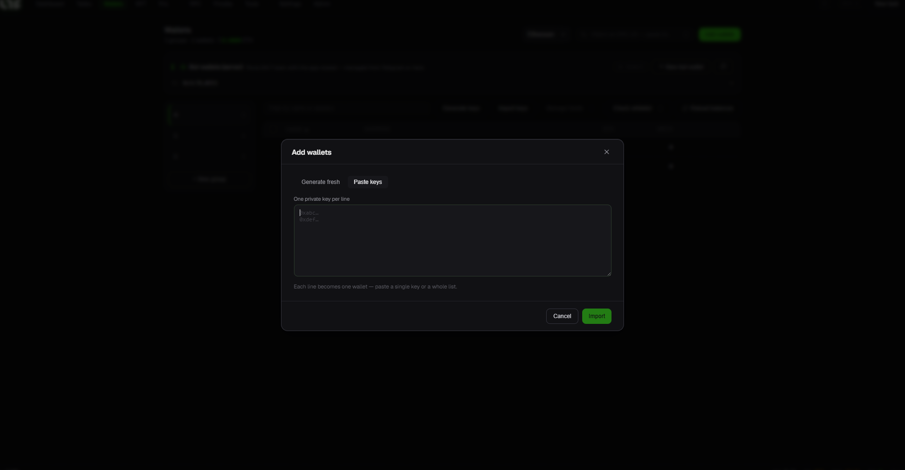
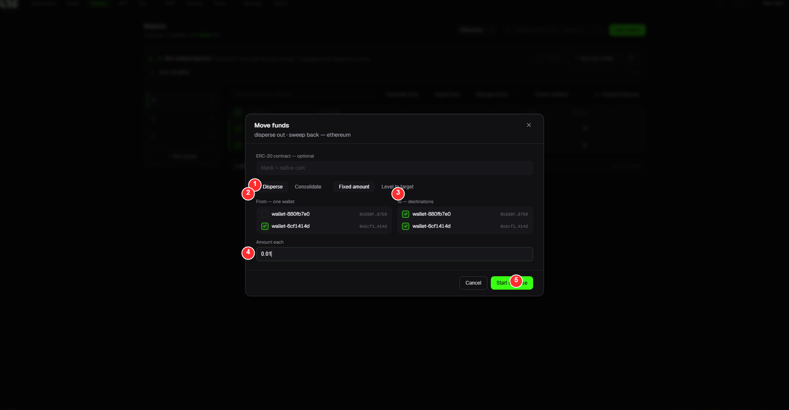

# Wallets

Manage the wallets you mint with. Create or import wallets, view balances, and move funds.

> 🔍 *Close-up: **Add wallets** (generate / import) and **New bot wallet** (runs 24/7).*

## Top

* **Chain selector**: which chain's balances to show (Ethereum, Base, etc.).
* **Show ERC-20 balance**: enter a token address to show that token's balance as a column.
* **Add wallet**: add wallets.

## 🤖 Bot Wallet (server): for Telegram

The **Bot Wallet (server)** section at the top is a Telegram-only wallet that **runs 24/7 even with the app closed.**

* **Create bot wallet**: make a wallet for minting via Telegram.
* **Hide / Refresh**: toggle address visibility / refresh balance.

> 🔐 The bot wallet is a **burner (small-balance) wallet kept on the server** (so it can run 24/7). It's separate from regular in-app wallets (whose keys live only on your PC). **Don't put large funds in it.** → [Telegram Bot](../telegram/telegram-bot.md)

## Groups & wallet list

* **Group rail (left)**: organize wallets into groups. `+ New group`.
* **Wallet table**: checkbox · name · address · ETH · WETH. Check to act on several at once.
* **Filter by name/address**: search when you have many.

## Buttons

| Button | What it does |
|---|---|
| **Generate** | Create N new wallets (keys stored automatically) |
| **Import** | Paste a wallet's **private key** to import (multiple lines = multiple wallets) |
| **Manage Funds** | Move funds between wallets (below) |
| **Whitelist check** | Check whether selected wallets are on a drop's WL |
| **Refresh balances** | Reload balances |

> *The **Add wallets → Paste keys** modal: one private key per line, then **Import**.*

> 🔐 **Private keys are stored encrypted on your PC only** (never sent to the server). Still, use a **burner wallet** for minting.

## 💸 Manage Funds (Disperse / Consolidate)

For spreading gas to many wallets or collecting scattered balances back.

* **Disperse**: send ETH from one wallet → many wallets (gas top-up before minting)
* **Consolidate**: gather balances from many wallets → one wallet (`send-max`, nearly the full amount)

### 🎯 Worked example: spread gas to your wallets

Before a mint, send gas from **one funded wallet → all your minting wallets**:

| # | Step (example) |
|---|---|
| ① | Pick **Disperse** (one → many). *(Consolidate is the reverse: many → one)* |
| ② | **From**: the **one** wallet that holds the funds (the source) |
| ③ | **To**: the wallets that should **receive** gas (the destinations) |
| ④ | **Amount each**: how much ETH each wallet gets (e.g. `0.01`) |
| ⑤ | **Start disperse**: sends it. When done you see success/pending/failed, and you can **retry** only the failed ones. |

## Bottom bar (when wallets selected)

For selected wallets: **Copy addresses / Export keys (confirm) / Delete (confirm) / Clear**, etc.

> ⚠️ **Export keys** is the only feature that shows a private key on screen. Be careful not to expose the key to others, and never click it while screen-recording or streaming.
