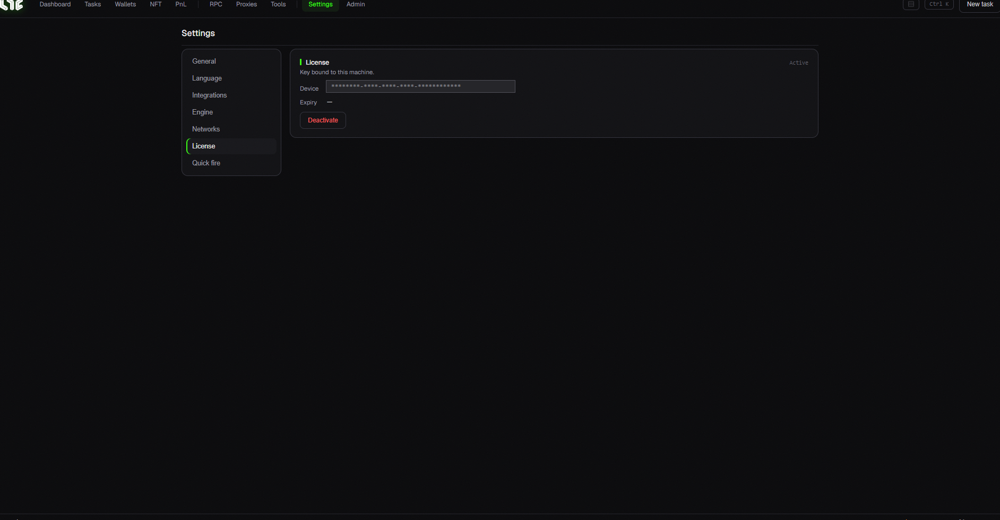

# 2. Activate Your License

You need a **license key** to use Nogada. Get key → enter → activate, just 3 steps.

## 1) Purchase

Pay for a subscription on the operator's **Whop page**.

## 2) Get your license key

After payment, you can receive your key **two ways** (both work):

### 📩 Method A: Email (automatic, recommended)

Right after payment, your license key is **emailed automatically to your purchase email** (arrives within minutes: **be sure to check spam**).

The key looks like: `NOGADA-XXXX-XXXX-XXXX-XXXX`

### 🤖 Method B: Telegram (if you didn't get the email)

1. Search for **@NOGADA\_Mint\_Bot** on Telegram and open a chat.
2. Send this (with the email you purchased with):

   ```
   /redeem youremail@example.com
   ```
3. The bot finds and sends your key.

> 💡 **If it says "key not found"**: make sure the email matches the one you bought with exactly. If it still fails, contact the operator.

## 3) Enter the key in the app → Activate

1. Open Nogada.
2. Paste the key into the field on the first screen (or **Settings → License**).
3. Click **Activate**.



> *Settings → License. Once activated, it shows your **device binding** and a **Deactivate** button (use it before moving to another PC). On first launch you'll instead see a **key field + Activate** button here.*

Once activated, all features unlock. A green **Authenticated ●** dot at the bottom-right means you're good.

## ⚠️ Important: One device per license

* **One license key works on only one PC.**
* **To switch PCs**: deactivate (release the device) on the old PC's app, then activate on the new PC. (If the old PC is too broken to open the app, ask the operator to reset the device.)

## Refund policy

Refunds are only offered for **install-blocking problems**. Minting success/failure depends on many variables (gas, remaining supply, project conditions), so it is **not guaranteed and not refundable.**

> ✅ **Summary**: Pay on Whop → get key by email (or Telegram /redeem) → paste in app & activate → check Authenticated ●.
