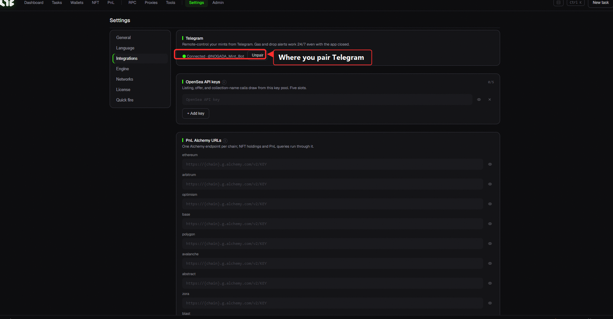

# Telegram Bot (Complete Guide)

The Nogada Telegram bot lets you mint and manage wallets **24/7 even with the app closed**. The heart of it is **bot tasks** — send **one line** in Telegram and **the server mints directly** from your bot wallets. It works while your computer is off, or while you sleep.

> 🤖 Bot: **@NOGADA\_Mint\_Bot**

> 💡 **Bot tasks vs app tasks — read this first**
> * **🤖 Bot tasks (24/7)** — the server mints with your **bot wallets**. **App (computer) can be off.** This is what this page is about.
> * **💻 Auto-mint (app task)** — creates a task in the app (full engine: OpenSea relay, advanced features). But the **app must be running**.
> To catch a mint while you're asleep → use **bot tasks**.

---

## 1) Connect (pairing)

Only someone **linked to your license** can control the bot.

1. In the app go to **Settings → Integrations**.
2. Find the **pairing code** shown there.
3. Open **@NOGADA\_Mint\_Bot** in Telegram and **send that code**.
4. When you see "Connected!", you're done.



> *Settings → Integrations. The **Telegram** section shows the connection state. Before pairing, a **code** appears here — send it to the bot to connect.*

> ⚠️ **Treat the pairing code like a password.** Never reveal it while recording/streaming — anyone who sees it could pair to your bot and drain your bot wallets.

> 💡 One license = one linked chat. Pairing from a new device/account auto-unlinks the old one.

---

## 2) Bot wallets (kept on the server) — your minting funds

To mint from Telegram, your **bot wallets** need funds. Unlike the app's on-device wallets, bot wallets are **stored (encrypted) on the server**, so the bot can sign and fire even when the app is closed.

**Menu: 💼 Wallets → 🤖 Bot wallets (24/7)**

| Button | What it does |
|---|---|
| ➕ New wallet / ➕ New ×5 | Issue new bot wallet address(es) |
| 🔐 Import key | Register an existing private key (0x + 64 hex) as a bot wallet |
| 🔑 Export key | Get a bot wallet's private key (not while recording; delete the message after) |
| 💸 Withdraw | Sweep a bot wallet's ETH/funds **to your main wallet** |
| 🗑 Delete | Remove a bot wallet |

> 🔐 **Bot wallets are for "burner" (small) amounts. Don't keep large funds here.**
> The key lives on the server so it can run 24/7 — so fund only **what a mint needs**. Keep main funds in the app's **App wallets** (on your PC only). Move minted NFTs / leftover ETH out anytime with **💸 Withdraw**.

---

## 3) The bot menu at a glance

| Button | What |
|---|---|
| 💼 Wallets | Bot wallets (24/7) · App wallets |
| ⚙️ Tasks | **Bot tasks (server-run)** · App tasks |
| 🎁 Drops | **Receive** operator-published drops (→ 24/7 bot task) |
| 👀 Drop watch | Watch a contract's supply → alert when minting starts |
| ⛽ Gas | Live gas |
| 🤖 Auto-mint | Create/run a task **in the app** (app must be on) |
| 📋 Mint history / 🖼 Portfolio | History · holdings |
| 🛠 Settings | Bot-only RPC · proxies |
| ℹ️ Status / 🌐 Language | Status · EN/KO |

---

## 4) ⭐ Bot tasks — mint in one line

This is the core. Tap **⚙️ Tasks → 🤖 Bot tasks → ➕ New bot task** and the bot shows the one-line format. Send a line like below; the task is created, and **▶** fires from your bot wallets.

### Basic format

```
0xcontract [chain] [qty] [priceETH] [mode]
```

| Field | Meaning | If omitted |
|---|---|---|
| **0xcontract** *(required)* | the NFT contract to mint | — |
| chain | eth · base · arb · op · poly · blast · linea · scroll · zora · avax · bnb · abstract · ape · ink · sepolia | `ethereum` |
| qty | items per wallet (1–100) | `1` |
| priceETH | ETH to send (the price for a paid mint) | `0` |
| mode | `auto`=`mint(qty)` · `sea`=OpenSea SeaDrop · `0x…`=raw calldata | `auto` |

> Simplest: `0xed5af3...c544` → `mint(1)` on Ethereum, free.
> One paid: `0xed5af3...c544 eth 1 0.01 sea` → OpenSea SeaDrop, 1 item at 0.01 ETH.

### Options — append `key=value` (space-separated)

| Option | Meaning | e.g. |
|---|---|---|
| `fire=spam` | 🔥 **spam** — retry until it lands, **auto-stop** on first success | `fire=spam` |
| `fire=safe` | 🛡 **safe** — simulate first, then fire once (skip would-fail wallets) | `fire=safe` |
| *(none)* | **instant once** (default) | |
| `tip=` | ⛽ priority fee (gwei) — **higher = mined sooner** | `tip=8` |
| `fee=` | ⛽ max fee (gwei) cap | `fee=80` |
| `gas=` | gas limit (manual) | `gas=120000` |
| `max=` | spam **max sends** (empty = unlimited) | `max=200` |
| `delay=` | spam **gap (ms)** | `delay=300` |
| `at=` | ⏰ **schedule**: `+5m`·`+2h`·`HH:MM` (UTC) | `at=16:59` |
| `sig=` | 🔧 mint **function signature** | `sig=mintPublic(uint256,address)` |
| `args=` | 🔧 args (`;`-separated, `{address}` allowed) | `args=2;{address}` |
| `sweep=` | 📦 safe wallet to move minted NFTs to | `sweep=0xSafe…` |
| `fb=1` | 🛡 mainnet **Flashbots** (instant/safe modes) | `fb=1` |

Order doesn't matter, e.g. `0xed5af3...c544 eth 1 0.01 fire=spam tip=8 at=+10m`

---

### 🔘 Fire mode (`fire=`)

| Mode | What | When |
|---|---|---|
| **instant once** *(default)* | fire **once** per wallet | hit ▶ at mint time, or **schedule** it. Fastest |
| `fire=safe` | **dry-run** first → skip would-fail wallets, fire the rest once | mint safely without wasting gas |
| `fire=spam` | **retry until it lands** → auto-stop on success | mint time unknown, or fierce competition |

> 💡 **Spam (`fire=spam`) is the "set it and it catches" mode.** It keeps knocking while the mint is closed, grabs it the instant it opens, and **stops itself once confirmed on-chain** (no extra gas).

> ⚠️ **Safe (`fire=safe`) is NOT a retry.** It simulates and fires once. Start it **before the mint opens** → simulation fails → it ends. To arm it early, use **schedule (`at=`)** or **spam**.

### ⏰ Schedule (`at=`)

Create it and hit ▶ early — the bot **waits until the time, then fires precisely** (shown as "armed").

| Use | Meaning |
|---|---|
| `at=+5m` · `at=+2h` · `at=+30s` | **from now** (recommended — no confusion) |
| `at=16:59` | today/tomorrow **16:59 (UTC)** |

> 🕘 **`HH:MM` is UTC.** Convert from your local time (e.g. KST is UTC+9). When in doubt, use the **relative form (`+5m`/`+2h`)**.

> ⚠️ **A schedule doesn't survive a server restart.** If the operator redeploys/restarts the server, an armed schedule is dropped (rare). Re-hit ▶ then.

### ⛽ Custom gas (`tip=` `fee=` `gas=`)

Default is **auto** (tracks the market). To clearly win a competitive mint, bid higher yourself.

* `tip=` **priority fee (gwei)** — **this is the key to competition.** It's the tip to the miner, so higher = your tx goes in **first**.
* `fee=` **max fee (gwei)** — the cap per tx.
* `gas=` **gas limit** — auto (estimate) is usually fine; set it only for odd contracts where estimation reverts.

> 💡 Losing a hot drop repeatedly? → **raise `tip=`** (e.g. `tip=15`). More gas = you go ahead.

### 🔁 Spam knobs (`max=` `delay=`)

Only meaningful with `fire=spam`.

* `delay=` **gap between knocks (ms)**. `300` = every 0.3s, `1000` = every 1s. Smaller = aggressive, larger = saves RPC/gas.
* `max=` **max sends** (cap). ⚠️ Not "N successes" — it stops after N **sends**. Empty = unlimited. To avoid hammering a mint that will **never** work (sold out / not eligible), set a cap (or ⏹ stop).

### 🔧 Custom function (`sig=` `args=`)

Use when the mint isn't `mint(qty)` but a **different function**.

* `sig=mintPublic(uint256,address)` — name + arg types.
* `args=2;{address}` — values **`;`-separated**. `{address}` is **auto-replaced with each bot wallet's address**.
* If the function is **payable**, put the ETH to send in the **priceETH** field up front.

> e.g. `0xabc… eth 1 0.03 sig=mintPublic(uint256,address) args=1;{address}`
> → calls `mintPublic(1, yourBotWallet)` with 0.03 ETH.

> 💡 You usually don't need this — most mints work with `auto` (=`mint(qty)`) or OpenSea `sea`. And an **operator 🎁 drop** comes with all this **pre-filled**.

### 📦 Auto-move after mint (`sweep=`)

Add `sweep=0xSafeWallet` and the bot **auto-transfers** minted NFTs (ERC-721) to that safe wallet **right after a successful mint** — so they don't sit on the burner.

> 📦 Leftover ETH isn't auto-moved — use **💸 Withdraw** for that.

### 🛡 Flashbots — anti-front-run on mainnet (`fb=1`)

Add `fb=1` (Ethereum **mainnet only**) to submit straight to builders **privately** instead of the public mempool.

* **Why?** A profitable mint in the public mempool can be **front-run** by MEV bots outbidding your gas. Flashbots is the **private channel** that prevents that.
* Works in **instant/safe** modes only (spam fires publicly + fast by design).
* **No public fallback** — if no builder includes the bundle, the mint just doesn't land (it won't re-expose publicly). Retry as needed.

> Keep it off normally; turn it on for **fierce mainnet drops**. e.g. `0xabc… eth 1 0.08 tip=15 fb=1`

---

### 🎬 Real examples

```text
# 1) Fire 1 in 10 minutes (OpenSea paid drop)
0xed5af3...c544 eth 1 0.05 sea at=+10m

# 2) Competitive mint — spam (mint at 08:00 UTC)
0xed5af3...c544 eth 1 0.01 fire=spam tip=10 delay=300 at=08:00

# 3) Safe — only wallets that pass simulation (Base, 2)
0xed5af3...c544 base 2 0.02 fire=safe

# 4) Custom function + sweep to a safe wallet
0xabc... eth 1 0.03 sig=mintPublic(uint256,address) args=1;{address} sweep=0xSafe...

# 5) Mainnet — Flashbots private (anti front-run)
0xabc... eth 1 0.08 tip=15 fb=1
```

> ▶ fires **all your bot wallets in parallel**. When done, the bot DMs you **per-wallet results** (success/fail · items received · swept · tx links).

---

## 5) 🎁 Receive drops — operator drops as 24/7 tasks

When the operator publishes drops, they appear under **🎁 Drops**.

1. Open **🎁 Drops** → each drop shows its **phases** (Public/GTD/FCFS…), price, max qty.
2. Tap **「Get」** on the phase you want.
3. That phase is **turned into a bot task automatically** (contract, function, price, qty all set).
4. **▶** to run — or if it's set to **spam**, it knocks until the mint opens.

> 💡 The easiest path: no need to type a contract or function — just **receive what the operator already configured**. Fund the bot wallets and go.

> *Slug-only OpenSea drops (no contract address) or allowlist phases needing a signature show "get in app" — receive those via the app's **🤖 Auto-mint** instead.*

---

## 6) ⛽ Gas · 👀 Drop watch · 🖼 Portfolio · 📋 History · 🛠 Settings

| Menu | What |
|---|---|
| ⛽ **Gas** | live gas across chains |
| 👀 **Drop watch** | register a contract → **alert** when supply grows (minting started). Works with the app off |
| 🖼 **Portfolio / 📋 Mint history** | holdings · past mints |
| 🛠 **Settings** | add bot-only **RPC** / **proxy**. *Fast RPC matters for competitive mints* → [RPC/nodes](../resources/nodes.md) |

> 💡 **Watch + bot task combo:** put a drop in 👀 Watch; you get an alert the instant it opens. Then fire a 🤖 bot task with `fire=spam` to catch it. (Even better: pre-arm with `at=`.)

---

## 7) Get your license key (`/redeem`)

Even before activating, you can fetch your key from the bot:

```
/redeem your-purchase-email@example.com
```

→ the bot sends your `NOGADA-…` key. (More → [License activation](../getting-started/license.md))

---

## 8) Safety & tips

* 🔐 **Small amounts in bot wallets.** Big funds → app wallets (this PC). After minting, **💸 Withdraw** or `sweep=`.
* 🤐 **Pairing code / exported keys are passwords.** Never reveal while streaming/recording.
* ⛽ **Raise `tip=`** and set a fast **RPC** for hot drops.
* ⏰ **Unknown time → spam** (`fire=spam`); **known time → schedule** (`at=`). Both? schedule + spam works too.
* 🕘 `HH:MM` is **UTC**. When in doubt use `+5m`/`+2h`.
* 🛑 For mints that will never work (sold out / not eligible), cap with `max=` or ⏹ stop so it doesn't hammer forever.

---

> ✅ **In short**
> Send the pairing code from Settings→Integrations → connect → **create & fund (small) a bot wallet** → **⚙️ Tasks → Bot tasks → ➕** with one line (e.g. `0x… eth 1 0.01 fire=spam tip=8 at=+10m`) → ▶. Or **🎁 Drops** → Get. The bot mints **24/7 with the app off**.
