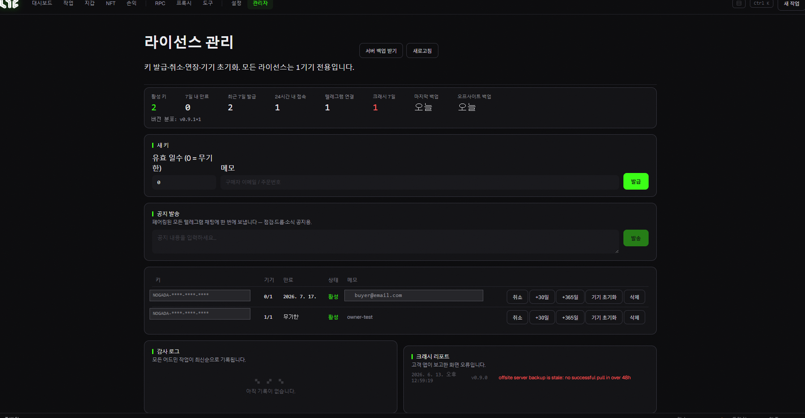

# 관리자 (운영자 전용)

이 화면은 **운영자(어드민) 라이선스로 로그인했을 때만** 메뉴에 나타납니다. 일반 사용자에게는 보이지 않습니다. 라이선스 키 발급·관리와 운영 현황을 다룹니다.

> 🙋 **일반 사용자라면 이 페이지는 건너뛰셔도 됩니다.**

## 현황 타일 (Fleet 통계)

한눈에 보는 운영 지표:

* **활성 키 / 7일 내 만료 / 최근 7일 발급**
* **24시간 내 접속 / 텔레그램 연결 수**
* **크래시 7일** (고객 앱이 보고한 오류 수)
* **마지막 백업 / 오프사이트 백업** · **버전 분포**

## 키 관리

* **새 키 발급** — 유효 일수(0=무기한) + 메모(구매자 이메일/주문번호)를 넣고 발급.
* **키 목록** — 각 키마다:
  * **취소(Revoke)** / 취소 해제 — 접근 차단/복구
  * **+30일 / +365일** — 유효기간 연장
  * **기기 초기화(Reset device)** — 사용자가 새 PC에서 다시 활성화할 수 있게 기기 바인딩 해제
  * **삭제(Delete)** — 영구 삭제 (사용자 접근 잃음)

## 운영 도구

* **공지 발송** — 페어링된 모든 텔레그램 채팅에 한 번에 메시지 전송 (점검·드롭·소식).
* **감사 로그(Audit log)** — 모든 어드민 작업 기록 (최신순).
* **크래시 리포트** — 고객 앱이 보고한 화면 오류.
* **서버 백업 받기** — 최신 라이선스 DB를 운영자 PC로 내려받기 (오프사이트 백업).

> 💡 키 발급·취소는 앱의 이 화면에서, 또는 서버 CLI로도 할 수 있습니다. Whop 결제 시에는 **자동으로** 키가 발급되니, 보통 여기서 수동 발급할 일은 드뭅니다.
