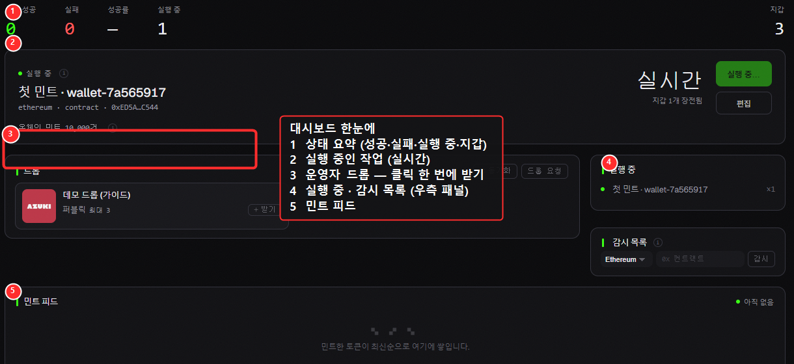

# 대시보드

앱을 켜면 가장 먼저 보이는 화면입니다. 지금 내 민팅 상황을 **한눈에** 보여줍니다.

## 공통: 모든 화면에 있는 요소

* **상단 메뉴(왼쪽)**: 대시보드 · 작업 · 지갑 · NFT · 손익 · RPC · 프록시 · 도구 · 설정. 클릭해서 화면을 이동합니다.
* **상단 오른쪽 버튼**
  * **⌘K (Ctrl + K)**: 어디서든 누르면 **명령 팔레트**가 열려, 검색만으로 화면 이동이나 명령 실행이 가능합니다.
  * **새 작업**: 빠르게 새 민팅 작업을 만듭니다.
  * **행 간격 전환**: 목록을 빽빽하게/널널하게 보기 토글.
* **하단 상태줄**: `준비됨` · `가스`(실시간 가스 시세) · `rpc`(연결된 RPC 수) · `동기화`(서버 시간차) · `인증 ●`(라이선스 정상이면 초록) · `버전`.

> 💡 하단의 **가스 숫자**는 실시간입니다. 민팅 직전 가스가 튀고 있지 않은지 여기서 빠르게 확인하세요.

## 대시보드 구성

* **통계 타일**: 민트 성공 / 실패 / 성공률 / 실행 중 / 지갑 수
* **대기 중인 작업**: 만들어 둔 작업이 여기 표시됩니다. `+ 새 작업`으로 바로 만들 수 있습니다.
* **민트 피드**: 민팅에 성공한 토큰이 최신순으로 쌓입니다.
* **실행 중**: 지금 돌아가는 작업 상태.
* **감시 목록(Watchlist)**: 관심 있는 컬렉션의 컨트랙트 주소를 넣고 **감시**를 누르면, 공급량이 움직일 때 알려줍니다. (텔레그램과 연동하면 앱을 꺼놔도 알림을 받습니다.)
* **선별 드롭**: 게시된 추천 드롭이 있으면 표시됩니다.

> 💡 **감시 목록 + 텔레그램**: 감시 목록에 넣은 드롭은 텔레그램 봇이 24시간 지켜봐 줍니다. 앱을 꺼놔도 드롭이 풀리면 알림이 옵니다. → [텔레그램 봇](../telegram/telegram-bot.md)
