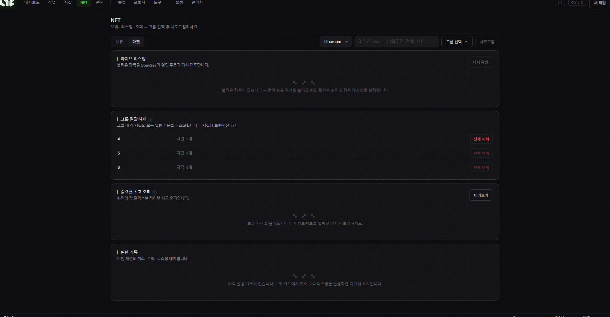

# NFT (보유 · 마켓)

민팅한 NFT를 확인하고, OpenSea에서 사고팔 때 쓰는 화면입니다. 위쪽에 **보유 / 마켓** 두 탭이 있습니다.

## 공통

* **체인 선택 / 그룹 선택 / 새로고침**: 어떤 체인·지갑 그룹의 NFT를 볼지 고른 뒤 목록을 갱신합니다.

## 📦 보유 (Holdings) 탭

내 지갑들이 가진 NFT 목록을 보여줍니다.

> ⚙️ 보유 목록을 불러오려면 **Alchemy URL**이 필요합니다. [설정 → Setup](../app-guide/settings.md)에서 체인별로 넣어두세요. (없으면 "Alchemy URL not configured"라고 뜹니다.)

## 🏷️ 마켓 (Market) 탭

OpenSea 리스팅·오퍼를 다룹니다. (대부분 **OpenSea API 키**가 있어야 동작합니다. → [설정](../app-guide/settings.md))

* **라이브 리스팅**: 불러온 내 NFT를 OpenSea의 열린 주문과 대조해 보여줍니다. "다시 확인"으로 갱신.
* **그룹 일괄 해제(Cancel All)**: 그룹 안 모든 지갑의 열린 리스팅을 한 번에 취소합니다 (지갑당 트랜잭션 1건). 각 그룹 옆 지갑 수가 표시됩니다.
* **컬렉션 최고 오퍼**: 각 컬렉션의 현재 최고 오퍼를 미리보기로 확인.
* (리스팅 생성 / 오퍼 수락 등도 여기서 합니다.)

> 💡 **민팅만 할 거라면 이 화면은 몰라도 됩니다.** 민팅한 NFT를 OpenSea에서 바로 팔거나 관리하고 싶을 때 쓰는 고급 화면입니다.
