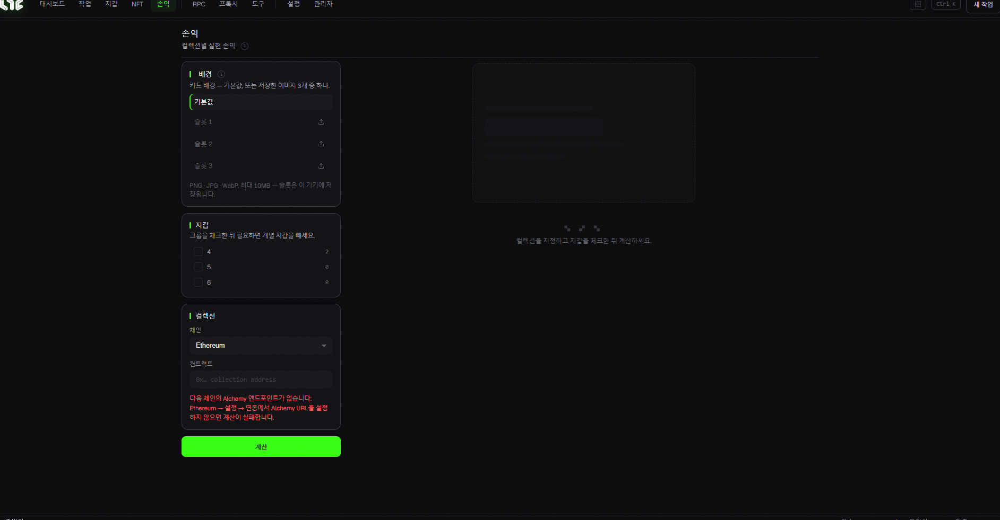

# 손익 (PnL)

민팅에 쓴 비용과 번 수익을 계산해, **공유하기 좋은 카드 이미지**로 만들어 주는 화면입니다.

## 사용법

1. **컬렉션** — 손익을 계산할 컬렉션의 체인 + 컨트랙트 주소를 넣습니다.
2. **지갑** — 계산에 포함할 지갑(그룹)을 체크합니다.
3. **(선택) 카드 배경** — 기본값을 쓰거나, 이미지 슬롯 3개에 원하는 배경(PNG/JPG/WebP, 최대 10MB)을 올릴 수 있습니다. 슬롯은 이 PC에만 저장됩니다.
4. **계산** — 결과가 **손익 카드**로 만들어집니다. (실현 손익 / ROI / 가스 / 총지출 / 회수액)

> ⚙️ 손익 계산에도 **Alchemy URL**이 필요합니다. [설정 → Setup](../app-guide/settings.md)에서 체인별로 넣어두세요.

> 💡 초록색 = 수익, 빨간색 = 손실로 표시됩니다. 만든 카드는 그대로 캡처해서 공유하면 됩니다.
