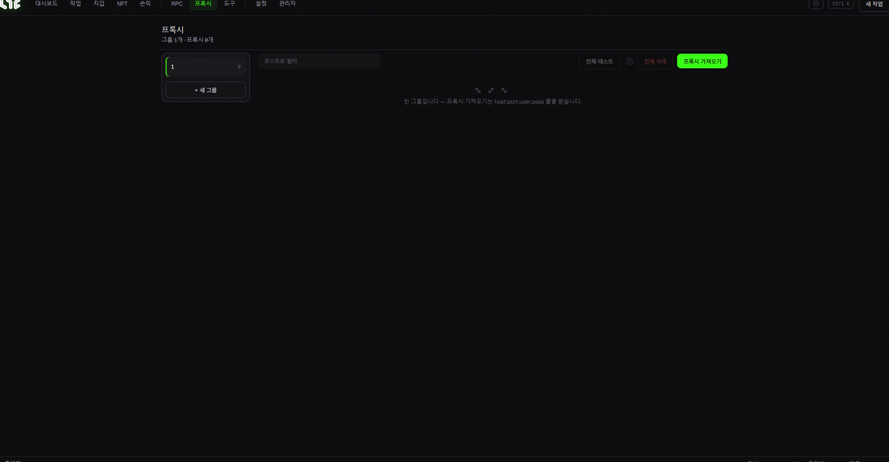

# 프록시 (Proxies)

프록시는 실제 IP를 가려, 동일한 IP에서 요청이 쏠리는 걸 방지합니다. **대부분의 일반 민팅엔 필요 없지만**, 지갑이 아주 많거나 웹사이트 기반 작업을 할 때 유용합니다.



## 언제 필요한가요?

* 지갑/계정 수십~수백 개로 **웹사이트(WL 사이트, 트위터, 디스코드)** 작업을 할 때 → 같은 IP로 몰리면 봇 탐지·차단·정지될 수 있어 프록시로 분산합니다.
* 단순히 컨트랙트에 민팅만 한다면 보통 **없어도 됩니다.**

## 형식

프록시는 보통 이 형식입니다:

```
host:port:username:password
```

여러 개를 줄 단위로 붙여넣을 수 있습니다.

## 화면 구성 / 버튼

* **그룹 레일(왼쪽)**: 프록시 그룹 관리. `+ 새 그룹`.
* **프록시 가져오기**: 위 형식으로 붙여넣어 추가.
* **전체 테스트**: 작동 여부·속도 확인.
* **전체 삭제**: 그룹 비우기.
* **호스트로 필터**: 많을 때 검색.

## 프록시 종류 (간단히)

* **레지덴셜(Residential)**: 실제 가정용 IP. GB 단위로 과금되며, 데이터가 남으면 계속 사용할 수 있습니다. 느린 편. 초보자에게 무난합니다.
* **ISP**: 더 빠르고 안정적, 보통 IP당 월 과금.

추천 제공사·구매 방법 → [프록시 링크](../resources/proxies.md)
