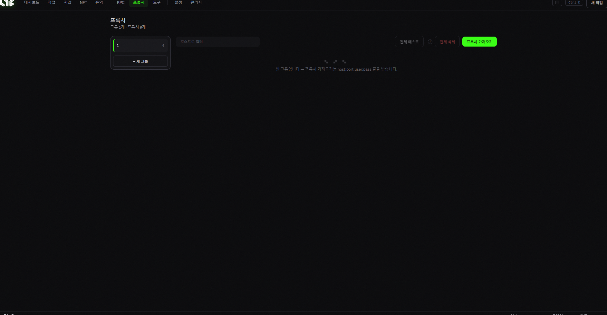

# 프록시 (Proxies)

프록시는 민팅 조회·voucher 요청·거래 전파를 사용자가 지정한 네트워크 경로로 보낼 때 사용합니다. **대부분의 일반 컨트랙트 민팅에는 필요하지 않습니다.**



## 언제 필요한가요?

* 다수 지갑의 서명/voucher 데이터를 같은 시각에 요청해 API 경로를 분산해야 할 때 사용합니다.
* 작업에 프록시 그룹을 선택하면 그 작업의 경로를 고정합니다. 지정 프록시가 실패하면 몰래 직접 연결로 바꾸지 않고 오류를 표시합니다.
* 단순 컨트랙트 민팅은 보통 프록시 없이 더 짧은 경로로 실행할 수 있습니다.

## 형식

프록시는 보통 이 형식입니다:

```
host:port:username:password
```

여러 개를 줄 단위로 붙여넣을 수 있습니다.

## 화면 구성 / 버튼

* **그룹 레일(왼쪽)**: 프록시 그룹 관리. `+ 새 그룹`.
* **프록시 가져오기**: 위 형식으로 붙여넣어 추가.
* **전체 테스트**: 작동 여부·속도 확인.
* **전체 삭제**: 그룹 비우기.
* **호스트로 필터**: 많을 때 검색.

## 프록시 종류 (간단히)

* **레지덴셜(Residential)**: 다양한 IP가 필요할 때 쓰지만 지연이 클 수 있습니다.
* **ISP**: 대체로 지연과 연결 안정성이 더 일정하지만 제공사별 품질 차이가 큽니다.

추천 제공사·구매 방법 → [프록시 링크](../resources/proxies.md)
