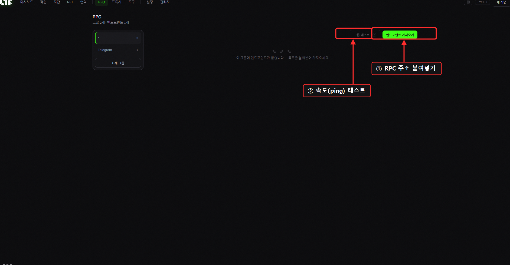
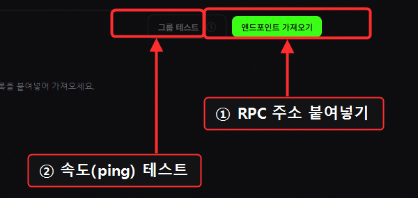
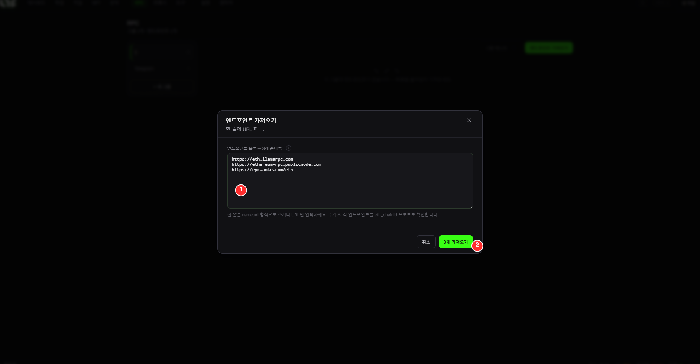

# RPC

**RPC**는 앱이 블록체인과 대화하는 통로입니다. 민팅 속도와 성공률에 **직접 영향**을 주는, 가장 중요한 세팅 중 하나입니다.

> 🔍 *확대: ① **엔드포인트 가져오기**(주소 붙여넣기) → ② **그룹 테스트**(속도 확인).*

## 화면 구성

* **그룹 레일(왼쪽)**: RPC를 그룹으로 관리. `+ 새 그룹`.
* **엔드포인트 가져오기**: RPC 주소를 붙여넣어 추가 (여러 줄 = 여러 개).
* **그룹 테스트**: 추가한 RPC들의 응답 속도(ping)를 측정.

## 무료로 RPC 넣기 (Chainlist)

1. [chainlist.org](https://chainlist.org)에 접속해 원하는 체인을 검색합니다.
2. 상단의 **HTTPS RPC 주소** 몇 개를 복사합니다.
3. Nogada **RPC** 화면 → **엔드포인트 가져오기**에 붙여넣습니다.
4. **그룹 테스트**로 ping이 낮은(빠른) 것만 남기세요.

### 🎯 실전 예시: RPC 3개 넣기

**엔드포인트 가져오기**를 누르고:

| # | 단계 |
|---|---|
| ① | **URL을 한 줄에 하나씩 붙여넣기** (여기서는 무료 공개 이더리움 RPC 3개) |
| ② | **가져오기** 클릭 → 그룹에 추가됨. 이어서 **그룹 테스트**로 ping 낮은(빠른) 것만 남기세요. |

> 💡 위 예시 URL은 무료 공개 RPC입니다(시작용으로 충분). 경쟁 민팅엔 **유료/전용** RPC도 함께 넣으세요 → [RPC / 노드 링크](../resources/nodes.md)

## 유료 RPC (경쟁 민팅엔 강력 추천)

저공급 선착순(FCFS) 민팅은 1~2블록 만에 끝납니다. 이때는 **공개 RPC의 속도 제한**에 걸리기 쉬워서, 유료 전용 RPC가 유리합니다.

* 추천 제공사·구매 방법 → [RPC / 노드 링크](../resources/nodes.md)

> 💡 **체인마다 잘 되는 제공사가 다릅니다.** 1~3개를 미리 준비해두고, 테스트해서 가장 빠른 걸 쓰세요. RPC 선택에 100% 정답은 없습니다.

## 멀티-RPC 브로드캐스트

[설정 → Setup](../app-guide/settings.md)에서 **멀티-RPC 브로드캐스트**를 켜면, 트랜잭션을 **여러 RPC로 동시에** 쏴서 더 빨리 블록에 들어갈 확률을 높입니다.

> 💡 **RPC는 등록만 해두면 자동으로 쓰입니다.** 작업에서 RPC를 **하나도 안 고르면** = 등록한 RPC **전부 + 공개 노드 풀**을 자동으로 같이 씁니다(가장 넓게 분산). 특정 RPC만 쓰고 싶을 때만 **체크**하세요(체크하면 그 RPC들만 쓰고 공개 풀은 섞지 않습니다).
