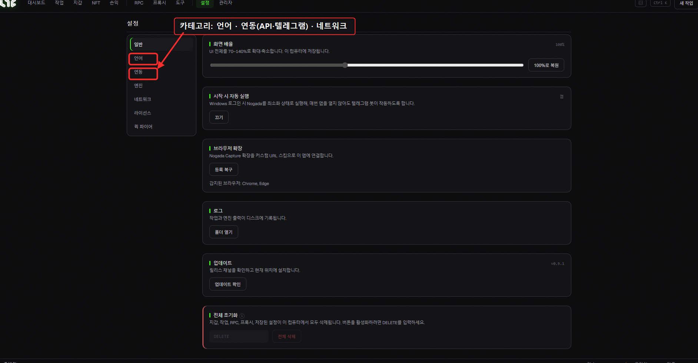
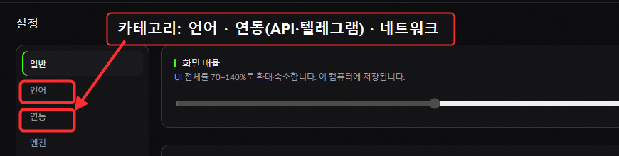

# 설정 (Settings)

앱 동작과 API 키를 설정하는 화면입니다. 왼쪽에 **7개 탭**이 있습니다.

> 🔍 *확대: 왼쪽에서 카테고리 전환 — **언어**, **연동**(API·텔레그램), 네트워크 등.*

## 일반 (General)

* **화면 배율** — UI 전체를 70~140%로 확대/축소 (이 PC에 저장).
* **시작 시 자동 실행** — Windows 로그인 시 Nogada를 최소화 상태로 자동 실행 (백그라운드에서 봇/알림이 돌게).
* **브라우저 확장** — Nogada Capture 확장을 앱과 연결 (감지된 브라우저: Chrome/Edge).
* **로그** — 작업·엔진 출력 기록 폴더 열기 (문제 생겼을 때 확인용).
* **업데이트 확인/적용** · **데이터 초기화(공장 초기화)** — 신중히.

## 언어 (Language)

* **한국어 / English** 전환. 누르면 앱 전체가 즉시 바뀝니다.

## 연동 (Integrations) — API 키

> 여기 키들은 **선택**입니다. **민팅 자체는 키 없이도 됩니다.** 각 키는 부가 기능을 켭니다.

| 키 | 무엇에 쓰나 | 받는 곳 |
|---|---|---|
| **OpenSea API 키** (≤5) | 리스팅 상태·베스트 오퍼·리스팅/수락 | docs.opensea.io |
| **Alchemy URL** (체인별) | NFT 보유목록 · 손익(PnL) | [alchemy.com](https://www.alchemy.com) |
| **Etherscan 키** | ABI 가져오기·익스플로러 조회 | [etherscan.io](https://etherscan.io) |
| **캡차 키** (CapMonster/CapSolver/2captcha) | 캡차 자동 풀기 (필요한 민팅에만) | 각 제공사 |
| **Discord 웹훅** | 민팅 성공/실패 알림을 디스코드로 | 디스코드 채널 설정 |

자세한 링크 → [리소스](../resources/nodes.md)

## 엔진 (Engine) — 민팅 동작

* **가스** — 자동 팁 배수(×), 최소 priority(gwei 하한).
* **Flashbots** — 번들 on/off, window/priority/max, reputation 키(복사/리셋).
* **스팸 가드레일(초)** — 스팸 민팅 시 안전 시간 (비우면 끔).
* **멀티-RPC 브로드캐스트** — 트랜잭션을 여러 RPC로 동시 전송 (속도↑).

## 네트워크 (Network)

* **체인별 공개 RPC 오버라이드** — 기본 공개 RPC를 원하는 것으로 교체.
* **체인 표시/숨김** — 안 쓰는 체인을 목록에서 숨기기.

## 라이선스 (License)

* **활성화 / 비활성화(기기 해제)** — PC를 바꿀 때 여기서 해제 후 새 PC에서 활성화.
* **HWID** — 이 기기 식별자 (복사 가능).

## 퀵 파이어 (Quick Fire)

* **퀵 태스크 지갑 / RPC** — 빠른 민팅(라이브민트 등)에 기본으로 쓸 지갑·RPC를 미리 지정.
