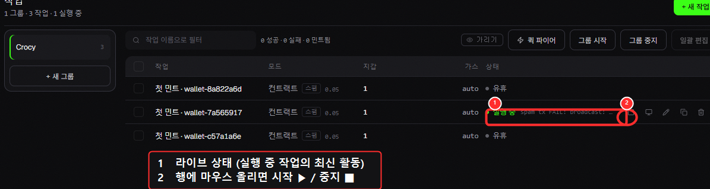
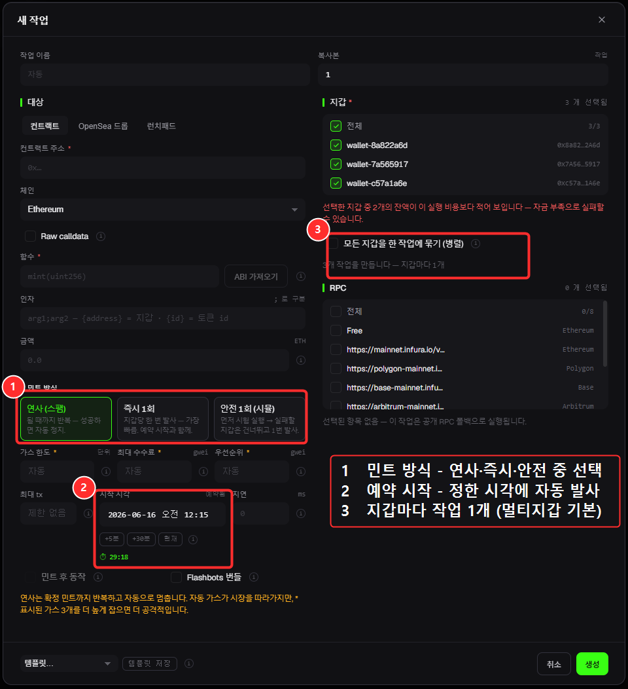
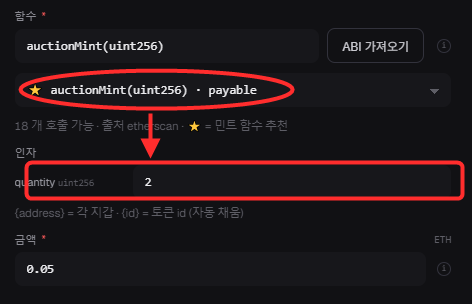
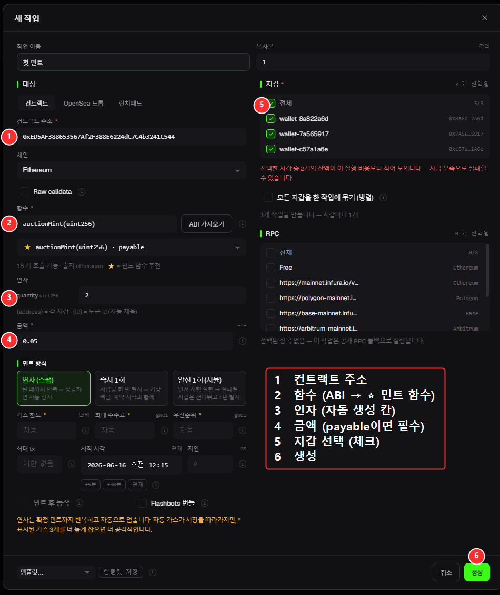

# 작업 (Tasks) — 민팅의 핵심

**작업**은 "어떤 컨트랙트를, 어떤 지갑으로, 어떻게 민팅할지"를 담은 한 건의 민팅 설정입니다. 작업을 만들고 **실행(Run)**하면 민팅이 시작됩니다.

> ⭐ **민트 방식(즉시·안전·스팸)·지연·가드레일·예약 시작·여러 지갑(병렬)이 헷갈리면 먼저 → [민트 방식 완전정복](../minting/modes.md)** 을 읽으세요. 이 페이지는 화면 위치 위주, 그 페이지는 "언제 뭘 쓰는지" 위주입니다.

## 화면 구성

* **그룹 레일(왼쪽)** — 작업을 그룹으로 묶어 관리합니다. `+ 새 그룹`으로 그룹을 만드세요. (예: "WL민트", "퍼블릭" 등)
* **툴바(오른쪽 위)**
  * **+ 새 작업** — 작업 편집기를 엽니다 (아래 상세).
  * **퀵 파이어** — 선택한 작업들을 빠르게 발사.
  * **그룹 시작 / 그룹 중지** — 그룹 안의 작업을 한꺼번에 실행/정지.
  * **일괄 편집** — 여러 작업의 설정을 한 번에 수정.

> ⚠️ 작업은 **그룹 안에** 들어갑니다. 그룹이 하나도 없으면 먼저 `+ 새 그룹`을 만드세요.

---

## ⭐ 새 작업 만들기 (편집기 완전 설명)

`+ 새 작업`을 누르면 편집기 창이 열립니다. 칸을 하나씩 보겠습니다.

> 🔍 *확대: 컨트랙트 주소를 넣고 **ABI 가져오기**를 누르면 함수가 자동으로 채워집니다.*

### 🎯 실전 예시 — 첫 민팅 따라하기

**목표:** **0.05 ETH짜리 NFT 1개**를 **지갑 2개**로 민팅. 번호 순서대로만 채우면 됩니다:

| # | 칸 | 무엇을 하나 (예시 값) |
|---|---|---|
| ① | **컨트랙트 주소** | 민팅할 NFT의 컨트랙트 주소 붙여넣기 — 예: `0x4E1f…480e56` |
| ② | **ABI 가져오기 → 함수** | **ABI 가져오기** 클릭 → 앱이 컨트랙트를 읽어 함수 목록을 보여줍니다. **`mint(uint256)`** 을 고르면 함수 칸이 채워짐. |
| ③ | **인자(Arguments)** | 함수를 고르면 **인자 칸이 자동 생성**됩니다(이름·타입 표시). `mint(uint256)`이면 **수량 칸 → `1`** |
| ④ | **금액(ETH)** | 1개당 **민팅 가격 → `0.05`** (무료 민팅이면 `0`) |
| ⑤ | **지갑 + RPC** | 민팅에 쓸 지갑 체크(**전체** = 2개), RPC도 최소 1개 체크 |
| ⑥ | **생성** | 끝 — 작업이 목록에 추가되고 **실행(Run)** 준비 완료 |

> 💡 빨간 *"지갑 잔액이 실행 비용보다 적어 보입니다"* 경고는 그 지갑에 아직 0.05 ETH가 없다는 뜻일 뿐입니다. 먼저 충전하세요 → [자금 관리](../app-guide/wallets.md).

> 🧩 **함수나 인자를 모르겠다고요?** 바로 그래서 **② ABI 가져오기**가 있습니다 — 컨트랙트의 실제 함수를 보여주니 추측할 필요가 없어요. 대부분의 퍼블릭 민팅은 `mint(uint256)`에 수량을 인자로 넣으면 됩니다.

---

### 왼쪽 — "무엇을 민팅할지"

| 칸 | 무엇을 넣나 |
|---|---|
| **작업 이름** | 비워두면 자동으로 정해집니다. 구분하고 싶으면 직접 입력. |
| **대상(탭)** | **컨트랙트** / **OpenSea 드롭** / **런치패드** 중 선택 (아래 설명) |
| **컨트랙트 주소** | 민팅할 NFT 컨트랙트 주소 (`0x...`) |
| **체인** | 민팅할 체인 (Ethereum, Base 등) |
| **Raw calldata** | 체크하면, 함수 대신 **hex 원본 데이터**를 직접 넣습니다 (고급) |
| **함수** | 민팅 함수 (예: `mint(uint256)`). 옆의 **ABI 가져오기**로 자동 채울 수 있음 |
| **인자(Arguments)** | **ABI에서 함수를 고르면 인자가 칸별로 자동 생성**됩니다(이름·타입 표시) — 순서 추측 불필요. `{address}`=각 지갑, `{id}`=토큰 id로 자동 치환. 함수가 **유료(payable)면 금액 칸이 필수**(빨간 별표). _(ABI 없이 직접 칠 땐 `;`로 구분)_ |
| **금액(ETH)** | 민팅 가격(1개당). 무료면 `0` |

#### 🔧 "ABI 가져오기" — 함수를 손으로 안 쳐도 됩니다

컨트랙트 주소를 넣고 **ABI 가져오기**를 누르면, 그 컨트랙트의 **함수 목록을 자동으로** 불러와 드롭다운으로 보여줍니다. 거기서 민팅 함수(`mint`, `publicMint` 등)를 고르면 함수 칸이 채워집니다. (Etherscan API 키를 [설정](../app-guide/settings.md)에 넣어두면 더 잘 됩니다. 없어도 Sourcify로 시도합니다.)

> 💡 **대상 탭 차이**
> * **컨트랙트** — 컨트랙트 주소 + 함수로 직접 민팅 (가장 일반적)
> * **OpenSea 드롭 / 런치패드** — 민팅 링크만 넣으면 **민팅 단계(phase)를 자동으로 인식**합니다. 단계만 고르고 나머지를 채우면 끝. (지원: OpenSea, Transient)

### 오른쪽 — "어떻게 민팅할지"

| 칸 | 무엇을 넣나 |
|---|---|
| **복사본(Copies)** | 같은 작업을 몇 번 반복할지 |
| **지갑(Wallets)** | 민팅에 쓸 지갑을 체크. **전체** 체크로 모두 선택 |
| **RPC** | 사용할 RPC 엔드포인트 체크. (안 고르면 공개 RPC로 실행) |

### 아래 — 저장

* **템플릿** — 자주 쓰는 설정을 템플릿으로 저장/불러오기.
* **취소 / 생성** — **생성**을 누르면 작업이 만들어집니다.

---

## 📋 새 작업 창 — 모든 칸 설명 (한눈에)

> 새 작업 팝업에 뜨는 **모든 칸**을 한 번에 정리했습니다. 개념(언제 뭘 쓰는지)은 → [민트 방식 완전정복](../minting/modes.md).

### 🎯 대상 — "무엇을 민팅?"
| 칸 | 설명 |
|---|---|
| **대상 탭** | **컨트랙트**(주소로 직접) / **OpenSea 드롭**(링크) / **런치패드** |
| **컨트랙트 주소 / 민트 링크** | 민팅할 NFT의 `0x…` 주소, 또는 오픈씨/런치패드 **링크** |
| **체인** | 민팅할 블록체인 (Ethereum, Base 등) |
| **Raw calldata** _(고급)_ | 함수 대신 **hex 원본 데이터**를 직접 넣음. 보통 안 씀 |
| **함수** | 민트 함수(예: `mint`). 옆 **ABI 가져오기**로 자동 채움 |
| **인자** | 함수가 요구하는 값. **함수를 고르면 칸이 이름·종류별로 자동 생성**. `{지갑}`/`{토큰id}` 자동 |
| **금액(ETH)** | 1개당 민팅 가격. 무료면 `0`. **유료(payable) 함수면 필수**(빨간 별표) |

### 🔥 민트 방식 (3택)
| 방식 | 설명 |
|---|---|
| **즉시 1회** | 지갑당 **한 번** 발사 — 가장 빠름 (예약과 함께 권장) |
| **안전 1회** | **시험 실행** 후 실패할 지갑은 건너뛰고 1번 발사 (헛가스 방지) |
| **연사** | **될 때까지 반복** → 성공하면 **자동 정지** (켜두면 알아서 잡음) |

### ⛽ 가스 (수수료)
| 칸 | 설명 |
|---|---|
| **가스 한도** | 거래가 쓸 수 있는 **최대 가스**. 보통 비워두면 자동 |
| **최대 수수료** | 낼 수 있는 가스 1단위당 **최대값(gwei)**. 자동 = 시세 추적 |
| **우선순위** | **채굴자 팁(gwei)**. 높을수록 먼저 박힘 — 경쟁에서 유리 |

### ⏱️ 타이밍 & 반복
| 칸 | 설명 |
|---|---|
| **시작 시각** | **예약 발사 시각**(달력+시계, 네 로컬 시간). 비우면 지금 발사 |
| **지연** _(연사)_ | 재시도 간격. `100` = 0.1초마다, `0` = 최대 속도 |
| **최대 tx** _(연사)_ | 최대 전송 횟수. 비우면 무제한(성공/수동중지까지) |
| **nonce** _(연사 아닐 때)_ | 보낼 거래 순번. 보통 자동 |

### 👛 지갑 & RPC
| 칸 | 설명 |
|---|---|
| **지갑** | 민팅에 쓸 지갑(여러 개 선택 가능). **기본은 지갑마다 작업 1개로 생성**(병렬). "한 작업에 묶기"로 묶을 수도 |
| **RPC** | 사용할 노드. 안 고르면 공개 RPC로 실행 |

### ⚙️ 옵션
| 칸 | 설명 |
|---|---|
| **민트 후 동작** | 민트되면 자동으로 **전송 / 오픈씨 리스팅 / 오퍼 수락** |
| **Flashbots 번들** | **프라이빗 멤풀**로 제출(이더리움 전용) — 일반 멤풀에 노출 없이 제출. 샌드위치/프론트런 방지에 유리 |
| **복사본** | 같은 작업을 N개 만들기 |
| **템플릿** | 자주 쓰는 실행 설정 저장/불러오기 |

---

## ▶ 발사하기: 실행 · 퀵 파이어 · 중지 · 부스트

작업을 만든 뒤, 실제로 쏘는 방법입니다:

* **실행(Run)** — **이 작업 하나**를 발사. 작업의 시작 시각에 트랜잭션이 나갑니다(시작=`현재`면 즉시).
  *예: WL 민팅을 시작 시각=오픈 시간으로 맞춰두고 **실행**을 누르면, 창이 열리는 순간 자동으로 쏩니다.*
* **⚡ 퀵 파이어** — 가장 빠른 방법. 작업을 **체크**하고 **퀵 파이어**를 누르면 편집기 없이 **지금 즉시 한꺼번에** 발사됩니다.
  *예: 기습 스텔스 민팅이 떴다 → 저장해둔 작업 체크 → **퀵 파이어** → 바로 발사.*
* **중지(Stop)** — 실행 중인 작업 정지.
* **🚀 부스트** — 가스가 낮아 트랜잭션이 안 박히고 멈춰 있을 때, **더 높은 가스로 다시 쏘기**. 자세히 → [트랜잭션 부스트](../minting/boost.md)
* **그룹 시작 / 그룹 중지** — 그룹 안의 **모든 작업을 한꺼번에** 실행/정지 (여러 지갑·컨트랙트 동시 발사에 좋음).

> 💡 **베스트 프랙티스**: 민팅 시간 3~5분 전에 작업을 **한 번 중지했다가 다시 실행**하세요 — 최신 온체인 데이터로 다시 불러옵니다(프로젝트가 막판에 설정을 바꾸기도 함).

가스 설정이 헷갈리면 → [가스 설정 완전정복](../minting/gas.md)
