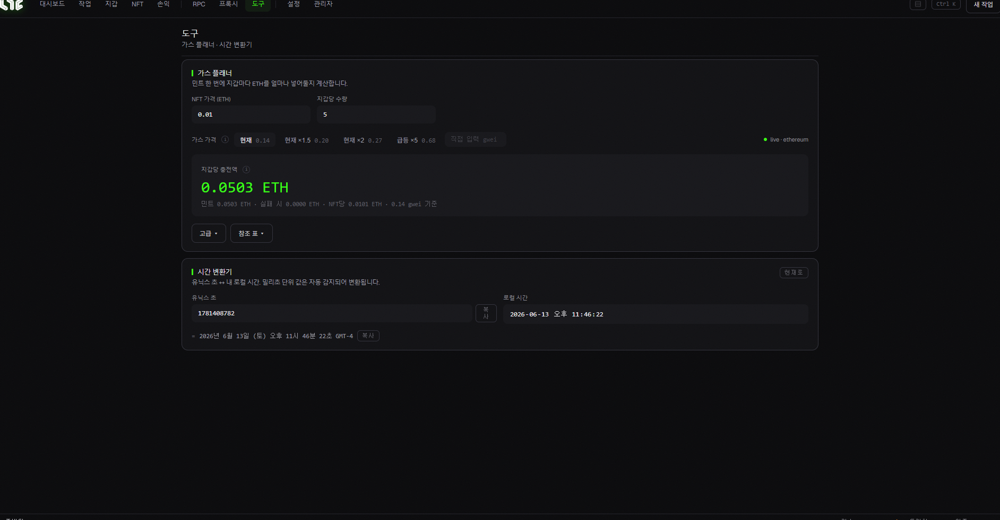

# 도구 (가스 계산기 · 시간 변환기)

민팅 전에 **비용과 시간을 미리 계산**하는 보조 도구 화면입니다.

## ⛽ 가스 플래너

"이번 민팅에 지갑당 ETH가 얼마나 들까?"를 미리 계산합니다.

1. **NFT 가격(ETH)**: 민팅 1개 가격을 입력 (무료면 0).
2. **지갑당 수량**: 한 지갑이 몇 개 민팅할지.
3. **가스 가격**: 버튼으로 고르거나 직접 입력:
   * **현재**: 지금 시세 그대로
   * **현재 ×1.5 / ×2**: 약간/많이 높여서 (경쟁용)
   * **급등 ×5**: 치열한 가스 전쟁용
   * **직접 입력(gwei)**: 원하는 값
4. **지갑당 총지출**: 위 값으로 **실시간 계산**되어 표시됩니다. (민트 비용 + 가스 합계)

> 💡 이 숫자를 보고, 지갑에 **그보다 20~50% 많은 ETH**를 넣어두면 안전합니다. 복잡한 컨트랙트는 가스를 더 먹을 수 있어서요.

* **고급 / 참조 표**: 가스 가격대별 비용 표를 펼쳐볼 수 있습니다.

## 🕐 시간 변환기

**유닉스 타임스탬프 ↔ 내 로컬 시간**을 서로 바꿔줍니다. 프로젝트가 "민팅은 유닉스 169...초에 시작"처럼 공지할 때 내 시간으로 정확히 환산할 수 있습니다.

* 유닉스 초를 넣으면 → 내 지역 시간으로
* (반대도 가능) · **복사** 버튼으로 결과 복사

> 💡 드롭 시간을 초 단위로 정확히 아는 건 선착순 민팅에서 큰 차이를 만듭니다.
