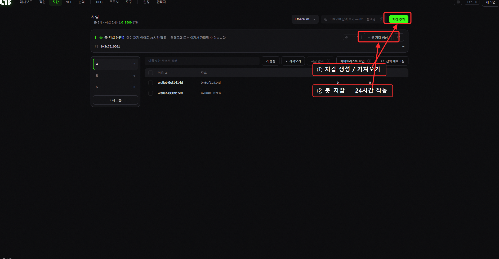
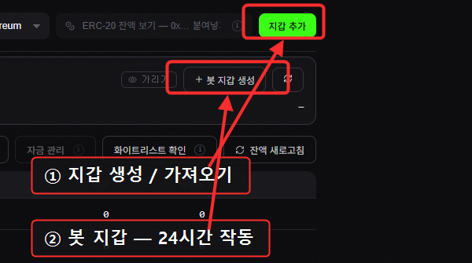
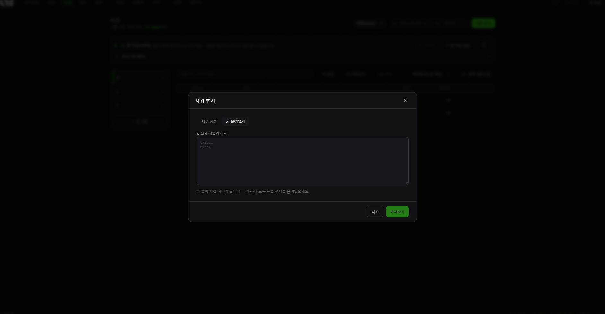
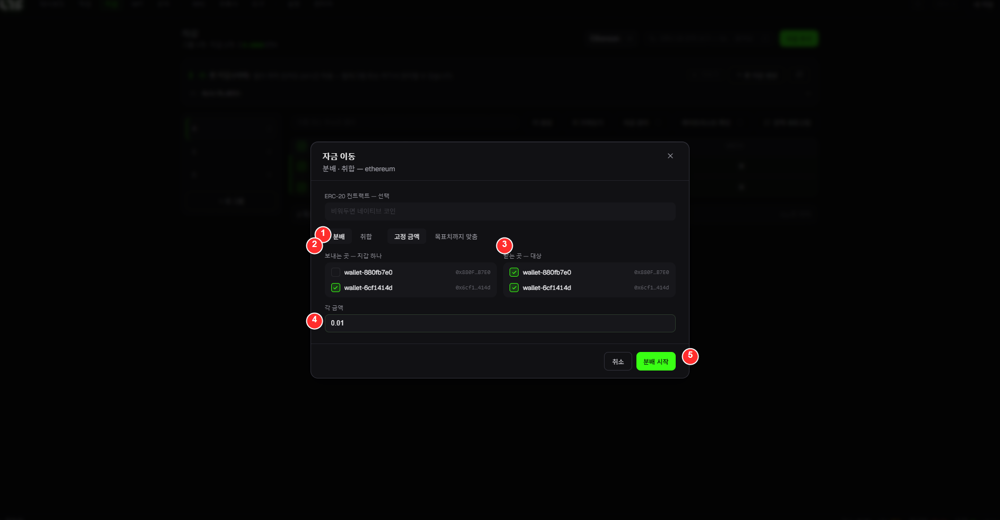

# 지갑 (Wallets)

민팅에 쓸 지갑을 관리하는 화면입니다. 지갑을 만들거나 가져오고, 잔액을 보고, 자금을 옮길 수 있습니다.

> 🔍 *확대: **지갑 추가**(생성·가져오기)와 **봇 지갑 생성**(24시간 작동).*

## 상단

* **체인 선택**: 어떤 체인의 잔액을 볼지 (Ethereum, Base 등).
* **ERC-20 잔액 보기**: 특정 토큰 주소를 넣으면 그 토큰 잔액을 컬럼에 표시.
* **지갑 추가**: 지갑을 새로 넣습니다.

## 🤖 봇 지갑 (서버): 텔레그램용

화면 위쪽의 **봇 지갑(서버)** 섹션은 **앱을 꺼놔도 24시간 작동하는** 텔레그램 전용 지갑입니다.

* **봇 지갑 생성**: 텔레그램으로 민팅할 지갑을 만듭니다.
* **가리기 / 새로고침**: 주소 숨김 토글 / 잔액 갱신.

> 🔐 봇 지갑은 **서버에 보관되는 버너(소액)용** 지갑입니다. 앱 안의 일반 지갑(개인키가 당신 PC에만 있는)과는 별개입니다. **큰돈을 넣지 마세요.** → [텔레그램 봇](../telegram/telegram-bot.md)

## 그룹 & 지갑 목록

* **그룹 레일(왼쪽)**: 지갑을 그룹으로 묶습니다. `+ 새 그룹`.
* **지갑 테이블**: 체크박스 · 이름 · 주소 · ETH · WETH. 체크해서 여러 개를 한 번에 다룹니다.
* **이름/주소로 필터**: 많을 때 검색.

## 버튼 설명

| 버튼 | 기능 |
|---|---|
| **키 생성(Generate)** | 새 지갑을 N개 자동 생성 (개인키 자동 보관) |
| **키 가져오기(Import)** | 기존 지갑의 **개인키를 붙여넣어** 가져오기 (여러 줄 = 여러 개) |
| **자금 관리(Manage Funds)** | 지갑 간 자금 이동 (아래 설명) |
| **화이트리스트 확인** | 선택한 지갑들이 특정 드롭의 WL에 들어있는지 확인 |
| **잔액 새로고침** | 잔액 다시 불러오기 |

> ***지갑 추가 → 키 붙여넣기** 모달: 한 줄에 개인키 하나씩 넣고 **가져오기**를 누릅니다.*

> 🔐 **개인키는 당신 PC에만 암호화 저장**됩니다(서버 전송 없음). 그래도 민팅엔 **버너 지갑**을 권장합니다.

## 💸 자금 관리 (Disperse / Consolidate)

여러 지갑에 가스를 나눠주거나, 흩어진 잔액을 한 지갑으로 모을 때 씁니다.

* **분배(Disperse)**: 한 지갑 → 여러 지갑으로 ETH를 보냄 (민팅 전 가스 충전)
* **모으기(Consolidate)**: 여러 지갑 → 한 지갑으로 잔액을 회수 (`send-max`로 거의 전액)

### 🎯 실전 예시: 지갑들에 가스 뿌리기

민팅 전, **자금이 있는 지갑 1개 → 민팅용 지갑 전부**로 가스를 보냅니다:

| # | 단계 (예시) |
|---|---|
| ① | **분배(Disperse)** 선택 (하나 → 여럿). *(취합은 반대: 여럿 → 하나)* |
| ② | **보내는 곳**: 자금이 들어있는 **그 한 지갑**(출발지) |
| ③ | **받는 곳**: 가스를 **받을** 지갑들(도착지) |
| ④ | **각 금액**: 지갑마다 보낼 ETH (예: `0.01`) |
| ⑤ | **분배 시작**: 전송. 끝나면 성공/대기/실패가 표시되고, 실패한 건만 **재시도** 가능. |

## 하단 바 (지갑 선택 시)

선택한 지갑에 대해 **주소 복사 / 키 내보내기(확인 필요) / 삭제(확인 필요) / 비우기** 등을 할 수 있습니다.

> ⚠️ **키 내보내기**는 개인키를 화면에 보여주는 유일한 기능입니다. 주변에 노출되지 않게 조심하고, 화면 녹화/스트리밍 중에는 절대 누르지 마세요.
