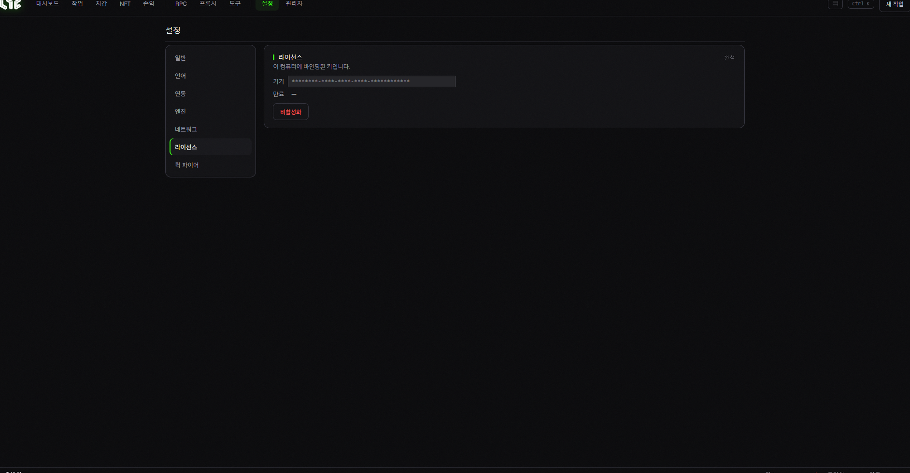

# 2. 라이선스 활성화

Nogada를 쓰려면 **라이선스 키**가 필요합니다. 키 받기 → 입력 → 활성화, 3단계면 됩니다.

## 1) 구매하기

운영자의 **Whop 판매 페이지**에서 구독을 결제합니다.

## 2) 라이선스 키 받기

결제가 끝나면 키를 **두 가지 방법** 중 하나로 받을 수 있습니다 (둘 다 됩니다):

### 📩 방법 A: 이메일 (자동, 추천)

결제 직후 **구매하신 이메일로 라이선스 키가 자동 발송**됩니다. (몇 분 안에 도착: **스팸함도 꼭 확인**하세요.)

키 형태는 이렇게 생겼습니다: `NOGADA-XXXX-XXXX-XXXX-XXXX`

### 🤖 방법 B: 텔레그램 (이메일을 못 받았을 때)

1. 텔레그램에서 **@NOGADA\_Mint\_Bot** 을 검색해 대화를 엽니다.
2. 아래처럼 입력하세요 (구매 시 사용한 이메일):

   ```
   /redeem 본인이메일@example.com
   ```
3. 봇이 당신의 키를 찾아서 보내줍니다.

> 💡 **"키를 찾지 못했습니다"가 뜨면**: 구매한 이메일과 입력한 이메일이 정확히 같은지 확인하세요. 그래도 안 되면 운영자에게 문의하세요.

## 3) 앱에 키 입력 → 활성화

1. Nogada 앱을 엽니다.
2. 첫 화면(또는 **설정 → 라이선스**)의 입력칸에 키를 붙여넣습니다.
3. **활성화** 버튼을 누릅니다.



> *설정 → 라이선스. 활성화된 뒤에는 **기기 바인딩**과 **비활성화** 버튼이 보입니다(다른 PC로 옮기기 전에 누르세요). 첫 실행 때는 이 자리에 **키 입력칸 + 활성화** 버튼이 나옵니다.*

활성화되면 앱의 모든 기능이 열립니다. 하단 오른쪽에 **인증 ●**(초록 점)이 보이면 정상입니다.

## ⚠️ 중요: 1기기 전용

* **하나의 라이선스 키는 한 대의 PC에서만** 사용할 수 있습니다.
* **PC를 바꿔야 한다면**: 기존 PC의 앱에서 라이선스를 **비활성화(기기 해제)** 한 뒤, 새 PC에서 다시 활성화하면 됩니다. (앱이 안 켜질 정도로 고장 났다면 운영자에게 기기 초기화를 요청하세요.)

## 환불 정책

환불은 **설치 자체가 안 되는 문제**에 한해 도와드립니다. 민팅 성공/실패는 가스·잔여 수량·프로젝트 상황 등 변수가 많아 **보장되지 않으며 환불 대상이 아닙니다.**

> ✅ **정리**: Whop 결제 → 이메일(또는 텔레그램 /redeem)로 키 받기 → 앱에 붙여넣고 활성화 → 인증 ● 확인.
