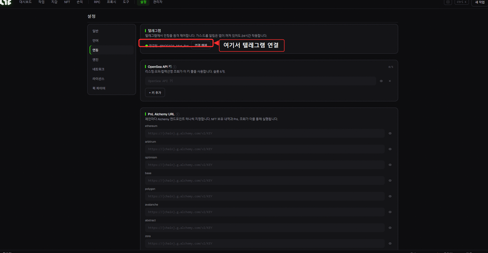

# 텔레그램 봇 사용법 (완전판)

Nogada 텔레그램 봇은 **앱을 꺼놔도 24시간** 민팅·지갑 관리를 해줍니다. 핵심은 **봇 작업**: 텔레그램에 **한 줄**만 보내면 **서버가 직접** 당신의 봇 지갑으로 민팅합니다. 컴퓨터가 꺼져 있어도, 자고 있어도 돌아갑니다.

> 🤖 봇 주소: **@NOGADA\_Mint\_Bot**

> 💡 **봇 작업 vs 앱 작업: 먼저 이것부터**
> * **🤖 봇 작업 (24/7)**: 서버가 **봇 지갑**으로 직접 민팅합니다. **앱(컴퓨터) 꺼도 됩니다.** 이 문서의 핵심이에요.
> * **💻 자동 민팅(앱 작업)**: 앱에 작업을 만들어 돌립니다(오픈씨 릴레이·고급기능 풀세트). 단, **앱이 켜져 있어야** 합니다.
> 자고 있는 동안 민팅을 잡고 싶다면 → **봇 작업**을 쓰세요.

---

## 1) 연결(페어링)하기

봇은 **당신의 라이선스와 연결된 사람만** 제어할 수 있습니다.

1. 앱에서 **설정 → 연동(Integrations)**으로 갑니다.
2. 거기 표시된 **페어링 코드**를 확인합니다.
3. 텔레그램에서 **@NOGADA\_Mint\_Bot**을 열고, 그 **코드를 그대로 보냅니다.**
4. "연결 완료!" 메시지가 오면 끝입니다.



> *설정 → 연동. **텔레그램** 섹션에 연결 상태가 표시됩니다. 아직 연결 전이라면 이 자리에 **페어링 코드**가 뜨고, 그 코드를 봇에게 보내면 연결됩니다.*

> ⚠️ **페어링 코드는 비밀번호처럼 다루세요.** 화면 녹화·스트리밍 중에는 절대 노출하지 마세요. 코드를 본 사람이 당신 봇에 연결해 봇 지갑을 털 수 있습니다.

> 💡 한 라이선스 = 하나의 연결된 채팅입니다. 새 기기/계정에서 새로 연결하면 이전 연결은 자동 해제됩니다.

---

## 2) 봇 지갑 (서버 보관): 민팅에 쓸 자금

텔레그램으로 민팅하려면 **봇 지갑**에 돈이 들어 있어야 합니다. 봇 지갑은 앱 안의 지갑과 달리 **서버에 (암호화되어) 보관**되어, 앱이 꺼져 있어도 봇이 대신 서명·발사할 수 있습니다.

**메뉴: 💼 지갑 → 🤖 봇 지갑 (24/7)**

| 버튼 | 하는 일 |
|---|---|
| ➕ 지갑 생성 / ➕ 5개 생성 | 새 봇 지갑(주소) 발급 |
| 🔐 키 가져오기 | 기존 개인키(0x+64자리)를 봇 지갑으로 등록 |
| 🔑 키 내보내기 | 봇 지갑 개인키 받기 (녹화 중 금지·받은 뒤 메시지 삭제) |
| 💸 회수 | 봇 지갑의 ETH/자금을 **내 메인 지갑으로** 빼내기 |
| 🗑 삭제 | 봇 지갑 삭제 |

> 🔐 **봇 지갑은 "버너(소액)"용입니다. 큰돈을 넣지 마세요.**
> 24시간 자동 작동을 위해 개인키를 서버에 보관하는 구조라, **민팅에 필요한 만큼만** 넣는 게 원칙입니다. 메인 자금은 앱의 **앱 지갑**(이 PC에만 저장)에 두세요. 민팅으로 받은 NFT나 남은 돈은 **💸 회수**로 언제든 안전한 지갑으로 빼낼 수 있습니다.

---

## 3) 봇 메뉴 한눈에

| 버튼 | 무엇 |
|---|---|
| 💼 지갑 | 봇 지갑(24/7) · 앱 지갑 보기 |
| ⚙️ 작업 | **봇 작업(서버 실행)** · 앱 작업 |
| 🎁 드롭 | 운영자가 발행한 **드롭 받기**(→ 24/7 봇 작업) |
| 👀 드롭 감시 | 컨트랙트 공급량 감시 → 민팅(풀림) 시 알림 |
| ⛽ 가스 | 실시간 가스 확인 |
| 🤖 자동 민팅 | **앱**에 작업 생성·실행(앱 켜져 있어야 함) |
| 📋 민팅 기록 / 🖼 포트폴리오 | 기록·보유 |
| 🛠 설정 | 봇 전용 RPC·프록시 |
| ℹ️ 상태 / 🌐 Language | 상태 · 한/영 전환 |

---

## 4) ⭐ 봇 작업: 한 줄로 민팅하기

여기가 핵심입니다. **⚙️ 작업 → 🤖 봇 작업 → ➕ 새 봇 작업**을 누르면, 봇이 한 줄 형식을 안내합니다. 거기에 아래처럼 보내면 작업이 만들어지고, **▶**를 누르면 봇 지갑들이 발사합니다.

### 기본 형식

```
0x컨트랙트 [체인] [수량] [가격ETH] [모드]
```

| 칸 | 뜻 | 안 쓰면 |
|---|---|---|
| **0x컨트랙트** *(필수)* | 민팅할 NFT 컨트랙트 주소 |, |
| 체인 | eth · base · arb · op · poly · blast · linea · scroll · zora · avax · bnb · abstract · ape · ink · sepolia | `ethereum` |
| 수량 | 한 지갑당 민트 개수 (1~100) | `1` |
| 가격ETH | 한 번에 보낼 ETH (유료 민트면 가격) | `0` |
| 모드 | `auto`=`mint(수량)` · `sea`=오픈씨 SeaDrop · `0x…`=직접 calldata | `auto` |

> 가장 단순한 예: `0xed5af3...c544` → 이더리움에서 그 컨트랙트에 `mint(1)`을 무료로 1회.
> 유료 1개: `0xed5af3...c544 eth 1 0.01 sea` → 오픈씨 SeaDrop으로 0.01 ETH에 1개.

### 옵션: 뒤에 `옵션=값`을 띄어서 붙이면 됩니다

| 옵션 | 뜻 | 예 |
|---|---|---|
| `fire=spam` | 🔥 **연사**: 성공할 때까지 반복, 첫 성공에 **자동 정지** | `fire=spam` |
| `fire=safe` | 🛡 **안전**: 시뮬 후 1회(실패할 지갑은 스킵) | `fire=safe` |
| *(없음)* | **즉시 1회** (기본) | |
| `tip=` | ⛽ 우선수수료(gwei), **높을수록 빨리 채굴됨** | `tip=8` |
| `fee=` | ⛽ 최대수수료(gwei) 상한 | `fee=80` |
| `gas=` | 가스 리밋(직접 지정) | `gas=120000` |
| `max=` | 연사 **최대 전송 횟수**(비우면 무제한) | `max=200` |
| `delay=` | 연사 **간격(ms)** | `delay=300` |
| `at=` | ⏰ **예약 발사**: `+5m`·`+2h`·`HH:MM`(UTC) | `at=16:59` |
| `sig=` | 🔧 민트 **함수 시그니처** | `sig=mintPublic(uint256,address)` |
| `args=` | 🔧 함수 인자(`;`로 구분, `{address}` 가능) | `args=2;{address}` |
| `sweep=` | 📦 민트 후 NFT 보낼 **안전 지갑** | `sweep=0xSafe…` |
| `fb=1` | 🛡 메인넷 **Flashbots**(즉시/안전 모드) | `fb=1` |

순서는 상관없습니다. 예: `0xed5af3...c544 eth 1 0.01 fire=spam tip=8 at=+10m`

---

### 🔘 민트 방식 (`fire=`)

| 방식 | 무엇 | 언제 |
|---|---|---|
| **즉시 1회** *(기본)* | 지갑당 **바로 1번** 발사 | 민트 시간에 직접 ▶ 하거나 **예약**할 때. 가장 빠름 |
| `fire=safe` | 먼저 **시험 실행** → 실패할 지갑은 건너뛰고 통과만 1번 | 헛가스 안 쓰고 안전하게 |
| `fire=spam` | 성공할 때까지 **계속 반복** → 성공 시 자동 정지 | 민트 시간을 모르거나 경쟁이 치열할 때 |

> 💡 **연사(`fire=spam`)가 "켜두면 알아서 잡아주는" 방식입니다.** 민트가 안 열린 동안엔 계속 두드리다가, 열리는 순간 잡아 민트하고, **체인에 확정되면 스스로 멈춥니다**(가스 더 안 씀).

> ⚠️ **안전(`fire=safe`)은 "재시도"가 아닙니다.** 시험 실행해보고 1번 쏘고 끝이에요. 민트가 **아직 안 열린 시각**에 켜면 → 시뮬 실패 → 종료. 미리 켜두려면 **예약(`at=`)** 또는 **연사(`fire=spam`)**를 쓰세요.

### ⏰ 예약 발사 (`at=`)

미리 만들어 ▶를 눌러두면, 봇이 **그 시각까지 기다렸다 정확히 발사**합니다(그동안 "무장됨"으로 표시).

| 쓰는 법 | 뜻 |
|---|---|
| `at=+5m` · `at=+2h` · `at=+30s` | **지금부터** 5분·2시간·30초 뒤 *(헷갈릴 일 없어 추천)* |
| `at=16:59` | 오늘/내일 **16:59 (UTC 기준)** |

> 🕘 **`HH:MM`은 UTC(세계표준시) 기준입니다.** 한국시간(KST)에서 −9시간이에요. 예) 한국 오후 5:00 민트 = **`at=08:00`**(UTC). 헷갈리면 **상대시간(`+5m`/`+2h`)**을 쓰는 게 안전합니다.

> ⚠️ **예약은 서버 재시작에 살아남지 않습니다.** 운영자가 서버를 재배포/재시작하면 무장 대기 중이던 예약은 풀립니다(드문 일). 그땐 다시 ▶ 하세요.

### ⛽ 가스 직접 지정 (`tip=` `fee=` `gas=`)

기본은 **자동**(시장에 맞춰 조절)입니다. 경쟁 민트에서 **확실히 앞서려면** 직접 높게 부르세요.

* `tip=` **우선수수료(gwei)**: **이게 경쟁의 핵심.** 채굴자에게 주는 팁이라, 높을수록 내 트랜잭션을 **먼저** 넣어줍니다.
* `fee=` **최대수수료(gwei)**: 한 트랜잭션에 낼 수 있는 가스 상한.
* `gas=` **가스 리밋**: 보통 자동(추정)이면 충분. 추정이 실패하는 특수 컨트랙트에서만 직접.

> 💡 인기 드롭에서 자꾸 떨어진다면 → **`tip=`을 올리세요**(예: `tip=15`). 가스를 더 내는 만큼 경쟁에서 앞섭니다.

### 🔁 연사 조절 (`max=` `delay=`)

연사(`fire=spam`)일 때만 의미 있습니다.

* `delay=` **두드리는 간격(ms)**. `300` = 0.3초마다, `1000` = 1초마다. 작을수록 공격적, 클수록 RPC·가스 절약.
* `max=` **최대 전송 횟수**(상한). ⚠️ "성공 N개"가 아니라 **N번 보내면 멈춤**. 비우면 무제한. **매진/자격없음처럼 영영 안 되는 민트**를 무한정 두드리지 않으려면 상한을 두세요(또는 직접 ⏹ 중지).

### 🔧 커스텀 함수 (`sig=` `args=`)

`mint(수량)`이 아닌 **다른 민트 함수**를 호출해야 할 때 씁니다.

* `sig=mintPublic(uint256,address)`, 함수 이름+인자 타입.
* `args=2;{address}`, 값들을 **`;`로 구분**. `{address}`는 **각 봇 지갑 주소로 자동 치환**됩니다.
* 함수가 **유료(payable)**면 보낼 ETH는 앞쪽 **가격ETH** 칸에 적습니다.

> 예: `0xabc… eth 1 0.03 sig=mintPublic(uint256,address) args=1;{address}`
> → `mintPublic(1, 내봇지갑주소)`를 0.03 ETH로 호출.

> 💡 어려우면 굳이 안 써도 됩니다. 대부분은 기본 `auto`(=`mint(수량)`) 또는 오픈씨 `sea`로 됩니다. **운영자가 발행한 🎁 드롭**을 받으면 이런 설정이 **이미 다 맞춰져** 있어요.

### 📦 민트 후 자동 옮기기 (`sweep=`)

`sweep=0x안전지갑`을 붙이면, **민트 성공 직후** 받은 NFT(ERC-721)를 그 안전 지갑으로 **자동 전송**합니다. 버너 봇지갑에 두지 않고 바로 메인으로 빼두고 싶을 때.

> 📦 ETH(남은 돈)는 자동으로 안 옮깁니다, 그건 **💸 회수**로 빼세요.

### 🛡 Flashbots: 메인넷 새치기 방지 (`fb=1`)

`fb=1`을 붙이면(이더리움 **메인넷만**) 트랜잭션을 공개 대기열 대신 **채굴자에게 비공개로 직접** 넣습니다.

* **왜?** 돈 되는 민팅을 공개 대기열에 띄우면 **MEV 봇이 보고 가스 더 질러 새치기**할 수 있어요. Flashbots는 그걸 막는 **비밀 통로**입니다.
* **즉시/안전 모드에서만** 작동합니다(연사는 공개로 빠르게 두드리는 방식이라 제외).
* **공개 폴백 없음**: 번들이 블록에 안 들어가면 그냥 안 나갑니다(공개로 다시 노출하지 않음). 재시도하면 됩니다.

> 평소엔 꺼두고, **경쟁 치열한 메인넷 인기 드롭**에서 새치기 방지로 켜세요. 예: `0xabc… eth 1 0.08 tip=15 fb=1`

---

### 🎬 실전 예시 모음

```text
# ① 10분 뒤 1개 즉시 발사 (오픈씨 유료 드롭)
0xed5af3...c544 eth 1 0.05 sea at=+10m

# ② 경쟁 민트 — 연사로 두드리기 (한국 오후 5시 = UTC 08:00)
0xed5af3...c544 eth 1 0.01 fire=spam tip=10 delay=300 at=08:00

# ③ 안전하게 — 시뮬 통과 지갑만 (Base, 2개)
0xed5af3...c544 base 2 0.02 fire=safe

# ④ 커스텀 함수 + 민트 후 안전지갑으로 스윕
0xabc... eth 1 0.03 sig=mintPublic(uint256,address) args=1;{address} sweep=0xSafe...

# ⑤ 메인넷 — Flashbots 프라이빗 (새치기 방지)
0xabc... eth 1 0.08 tip=15 fb=1
```

> ▶를 누르면 **연결된 봇 지갑 전부가 동시에(병렬)** 발사합니다. 끝나면 텔레그램으로 **지갑별 결과**(성공/실패·받은 개수·스윕 개수·tx 링크)를 보내줍니다.

---

## 5) 🎁 드롭 받기: 운영자 드롭을 24/7로

운영자(관리자)가 드롭을 발행해두면, 봇 메뉴 **🎁 드롭**에서 목록이 보입니다.

1. **🎁 드롭**을 엽니다 → 드롭별 **페이즈**(Public/GTD/FCFS 등)·가격·최대수량이 보입니다.
2. 받고 싶은 페이즈의 **「받기」** 버튼을 누릅니다.
3. 그 페이즈 설정이 **그대로 봇 작업으로 자동 생성**됩니다(컨트랙트·함수·가격·수량 다 맞춰져서).
4. **▶**로 실행: 또는 **연사**로 설정돼 있으면 민트 오픈까지 알아서 두드립니다.

> 💡 직접 컨트랙트 주소·함수를 칠 필요 없이, **운영자가 세팅해둔 걸 한 번에 받는** 가장 쉬운 길입니다. 봇 지갑에 자금만 있으면 끝.

> *오픈씨 **슬러그 전용**(컨트랙트 주소가 없는) 드롭이나 화이트리스트 서명이 필요한 일부 페이즈는 "앱에서 받기"로 표시됩니다: 그건 앱의 **🤖 자동 민팅**으로 받으세요.*

---

## 6) ⛽ 가스 · 👀 드롭 감시 · 🖼 포트폴리오 · 📋 민트 기록 · 🛠 설정

| 메뉴 | 하는 일 |
|---|---|
| ⛽ **가스** | 여러 체인의 실시간 가스를 한눈에 |
| 👀 **드롭 감시** | 컨트랙트 주소를 등록 → 공급량이 늘면(=민팅 시작) **즉시 알림**. 앱 꺼져 있어도 작동 |
| 🖼 **포트폴리오 / 📋 민팅 기록** | 보유 NFT·과거 민팅 기록 |
| 🛠 **설정** | 봇 전용 **RPC**·**프록시** 추가. *경쟁 민트는 빠른 RPC가 중요* → [RPC/노드 추천](../resources/nodes.md) |

> 💡 **감시 + 봇 작업 콤보:** 관심 드롭을 👀 감시에 넣어두면 풀리는 순간 알림이 옵니다. 그때 🤖 봇 작업을 `fire=spam`으로 켜면 바로 잡을 수 있어요. (아예 미리 `at=`로 예약해두면 더 좋고요.)

---

## 7) 라이선스 키 받기 (`/redeem`)

아직 활성화 전이어도, 봇에서 키를 받을 수 있습니다:

```
/redeem 구매한이메일@example.com
```

→ 봇이 당신의 `NOGADA-…` 키를 보내줍니다. (자세히 → [라이선스 활성화](../getting-started/license.md))

---

## 8) 안전 & 팁

* 🔐 **봇 지갑엔 소액만.** 큰돈은 앱 지갑(이 PC). 민팅 후엔 **💸 회수** 또는 `sweep=`.
* 🤐 **페어링 코드·내보낸 개인키는 비밀번호처럼.** 스트리밍·녹화 중 노출 금지.
* ⛽ **인기 드롭은 `tip=`을 올리고**, 빠른 **RPC**를 설정하세요.
* ⏰ **시간 모르면 연사**(`fire=spam`), **알면 예약**(`at=`). 둘 다면 예약+연사도 가능.
* 🕘 `HH:MM`은 **UTC**입니다. 헷갈리면 `+5m`/`+2h`로.
* 🛑 영영 안 되는 민트(매진·자격없음)는 무한 두드리지 않게 `max=`로 상한을 두거나 ⏹로 중지.

---

> ✅ **정리**
> 설정→연동의 페어링 코드 전송 → 연결 → **봇 지갑 생성·입금(소액)** → **⚙️ 작업 → 봇 작업 → ➕**에 한 줄(예: `0x… eth 1 0.01 fire=spam tip=8 at=+10m`) → ▶. 또는 **🎁 드롭**에서 골라 받기. **앱 꺼놔도 24시간** 봇이 대신 민팅합니다.
